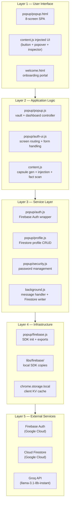
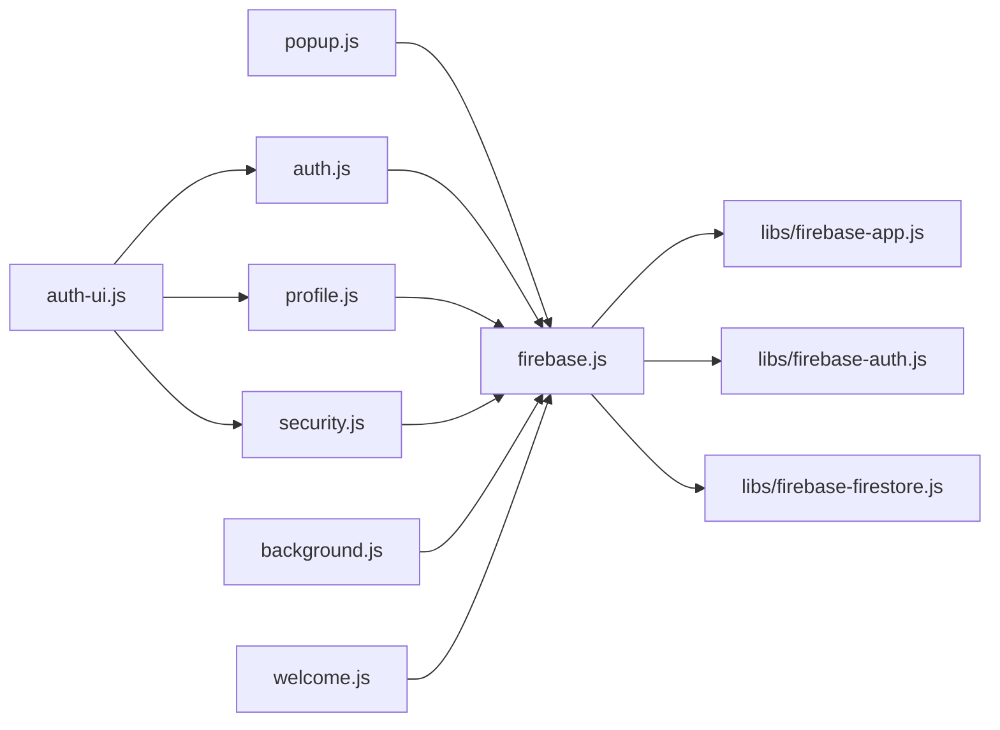

# Architecture — Synapse AI Link

> Reconstructed exclusively from codebase analysis. No assumptions made.

---

## System Overview

Synapse AI Link is a **Chrome Extension (Manifest V3)** with a fully client-side architecture. There is no custom backend server. All persistence runs through **Google Firebase** (Auth + Firestore), and AI processing is delegated to the **Groq API** (hosted LLM inference).

The system is composed of four distinct JavaScript execution contexts that communicate via Chrome's extension message-passing API:

| Context | File | Lifetime |
|---|---|---|
| Service Worker | `background.js` | Event-driven, spawned on demand |
| Content Script | `content.js` | Persistent per tab on supported LLM domains |
| Extension Popup | `popup/popup.js` + `popup/auth-ui.js` | Active while popup is open |
| Onboarding Page | `welcome.js` | Active while `welcome.html` tab is open |

---

## Component Boundaries

```mermaid
graph TB
    subgraph ChromeExtension["Chrome Extension (Manifest V3)"]

        subgraph ContentScript["Content Script Layer\n(content.js)"]
            CSAuth["Auth State Watcher"]
            CSScraper["DOM Conversation Scraper\n(4 platforms)"]
            CSGen["Capsule Generator\n(Groq + Local Fallback)"]
            CSInject["Platform Adapter Injectors\n(ChatGPT / Claude / Gemini / Perplexity)"]
            CSFacts["Fact Scanner\n(Regex, 30s interval)"]
            CSUI["Injected UI\n(Button + Popover + Inspector Modal)"]
        end

        subgraph ServiceWorker["Service Worker Layer\n(background.js)"]
            MsgRouter["Message Router\n(onMessage / onMessageExternal)"]
            CapsuleWriter["Capsule Writer\n(Firestore multi-write)"]
            PDFProcessor["PDF Processor\n(Groq summarization)"]
            CloudSync["Cloud Sync\n(syncCapsules / resolveCapsule)"]
            AuthHandler["Auth Handler\n(Google OAuth fallback)"]
        end

        subgraph PopupLayer["Popup Layer\n(popup/)"]
            PopupCtrl["popup.js\n(Vault Manager + Dashboard)"]
            AuthUI["auth-ui.js\n(Screen Router)"]
            AuthMod["auth.js\n(Firebase Auth Wrapper)"]
            ProfileMod["profile.js\n(Firestore Profile)"]
            SecurityMod["security.js\n(Password Change)"]
            FirebaseMod["firebase.js\n(SDK Init + Exports)"]
        end

        subgraph OnboardingLayer["Onboarding Layer\n(welcome.html)"]
            WelcomeJS["welcome.js\n(Auth Portal)"]
        end

        subgraph LocalStorage["chrome.storage.local"]
            LSCapsules["capsules[ ]"]
            LSVault["synapse_vault[ ]"]
            LSAuth["synapse_auth_status\nsynapse_auth_user"]
            LSIntercepted["synapse_intercepted{ }"]
        end

        subgraph Libs["libs/ (Bundled)"]
            PDFjs["pdf.min.js\n+ pdf.worker.min.js"]
            Mammoth["mammoth.min.js"]
            FBSDK["firebase/\n(App + Auth + Firestore)"]
        end
    end

    subgraph ExternalServices["External Services"]
        FBAuth["Firebase Auth\n(Google Cloud)"]
        Firestore["Cloud Firestore\n(Google Cloud)"]
        GroqAPI["Groq API\n(llama-3.1-8b-instant)"]
        GFonts["Google Fonts\n(Outfit)"]
    end

    subgraph LLMSites["Supported LLM Websites"]
        ChatGPT["chatgpt.com"]
        Claude["claude.ai"]
        Gemini["gemini.google.com"]
        Perplexity["perplexity.ai"]
    end

    %% Content Script ↔ LLM DOM
    CSScraper -->|"querySelectorAll"| ChatGPT
    CSScraper -->|"querySelectorAll"| Claude
    CSScraper -->|"querySelectorAll"| Gemini
    CSScraper -->|"querySelectorAll"| Perplexity
    CSInject -->|"value injection + event dispatch"| ChatGPT
    CSInject -->|"execCommand / paste"| Claude
    CSInject -->|"ClipboardEvent"| Gemini
    CSInject -->|"value setter"| Perplexity

    %% Content Script ↔ Service Worker
    CSGen -->|"sendMessage: saveCapsule"| MsgRouter
    CSGen -->|"sendMessage: resolveCapsule"| MsgRouter
    CSAuth -->|"sendMessage: checkAuth"| MsgRouter

    %% Content Script ↔ Local Storage
    CSAuth <-->|"get synapse_auth_status"| LSAuth
    CSFacts <-->|"get/set facts by URL"| LocalStorage
    CSGen <-->|"get capsules"| LSCapsules

    %% Popup ↔ Service Worker
    PopupCtrl -->|"sendMessage: processPDF"| MsgRouter
    PopupCtrl -->|"sendMessage: syncCapsules"| MsgRouter
    PopupCtrl -->|"sendMessage: loadProjectMemory"| MsgRouter

    %% Popup ↔ Local Storage
    PopupCtrl <-->|"capsules, vault"| LocalStorage
    AuthUI <-->|"synapse_auth_status"| LSAuth

    %% Popup ↔ Firebase (direct)
    AuthMod --> FirebaseMod
    ProfileMod --> FirebaseMod
    SecurityMod --> FirebaseMod
    FirebaseMod --> FBSDK
    FBSDK --> FBAuth
    FBSDK --> Firestore

    %% Service Worker ↔ Firebase
    MsgRouter --> CapsuleWriter
    MsgRouter --> PDFProcessor
    MsgRouter --> CloudSync
    MsgRouter --> AuthHandler
    CapsuleWriter --> Firestore
    PDFProcessor --> GroqAPI
    PDFProcessor --> Firestore
    CloudSync --> Firestore
    AuthHandler --> FBAuth

    %% Welcome ↔ Firebase
    WelcomeJS --> FBSDK
    WelcomeJS -->|"set synapse_auth_status"| LSAuth
    WelcomeJS -->|"sendMessage: authChange"| MsgRouter
```



---

## Technology Stack

| Category | Technology | Version / Notes |
|---|---|---|
| Extension Runtime | Chrome Manifest V3 | ES Module service worker |
| Language | JavaScript (ES2020+) | No TypeScript, no bundler |
| UI Framework | Vanilla HTML/CSS/JS | No React/Vue/Angular |
| Fonts | Google Fonts — Outfit | 300, 400, 500, 600, 700 weights |
| Authentication | Firebase Auth | Local SDK copy in `libs/firebase/` |
| Database | Cloud Firestore | Local SDK copy in `libs/firebase/` |
| AI Inference | Groq API | `llama-3.1-8b-instant` model |
| PDF Parsing | PDF.js | Bundled in `libs/pdf.min.js` + worker |
| DOCX Parsing | Mammoth.js | Bundled in `libs/mammoth.min.js` |
| Package Manager | npm | `firebase ^12.13.0` in package.json |
| Testing | Puppeteer (dev only) | `scratch/e2e_verification.js` |

---

## Manifest V3 Key Declarations

```json
{
  "manifest_version": 3,
  "permissions": ["activeTab", "storage", "scripting", "tabs"],
  "host_permissions": [
    "https://chatgpt.com/*", "https://chat.openai.com/*",
    "https://claude.ai/*", "https://gemini.google.com/*",
    "https://www.perplexity.ai/*",
    "https://*.firebaseapp.com/*",
    "https://*.identitytoolkit.googleapis.com/*",
    "https://*.firestore.googleapis.com/*",
    "https://api.groq.com/*"
  ],
  "background": { "service_worker": "background.js", "type": "module" },
  "action": { "default_popup": "popup/popup.html" },
  "web_accessible_resources": ["libs/pdf.min.js", "libs/pdf.worker.min.js", "libs/mammoth.min.js"],
  "externally_connectable": { "matches": ["https://synapse-ai.app/*"] }
}
```

---

## Layered Architecture



---

## Module Dependency Graph



---

## Communication Protocols

### Extension Message Passing (Internal)

All cross-context communication uses `chrome.runtime.sendMessage` / `chrome.runtime.onMessage`.

| Sender | Receiver | Actions |
|---|---|---|
| `content.js` | `background.js` | `checkAuth`, `saveCapsule`, `resolveCapsule` |
| `popup/popup.js` | `background.js` | `syncCapsules`, `processPDF`, `loadProjectMemory` |
| `popup/auth.js` | `background.js` | `login` (Google OAuth fallback) |
| `welcome.js` | `background.js` | `authChange` |
| `synapse-ai.app` | `background.js` | `externalAuth` (via `onMessageExternal`) |

### Storage Events (Cross-Context Sync)

`chrome.storage.onChanged` listeners in `content.js` and `auth-ui.js` react to changes in `synapse_auth_status` to synchronize UI state without explicit message passing.
