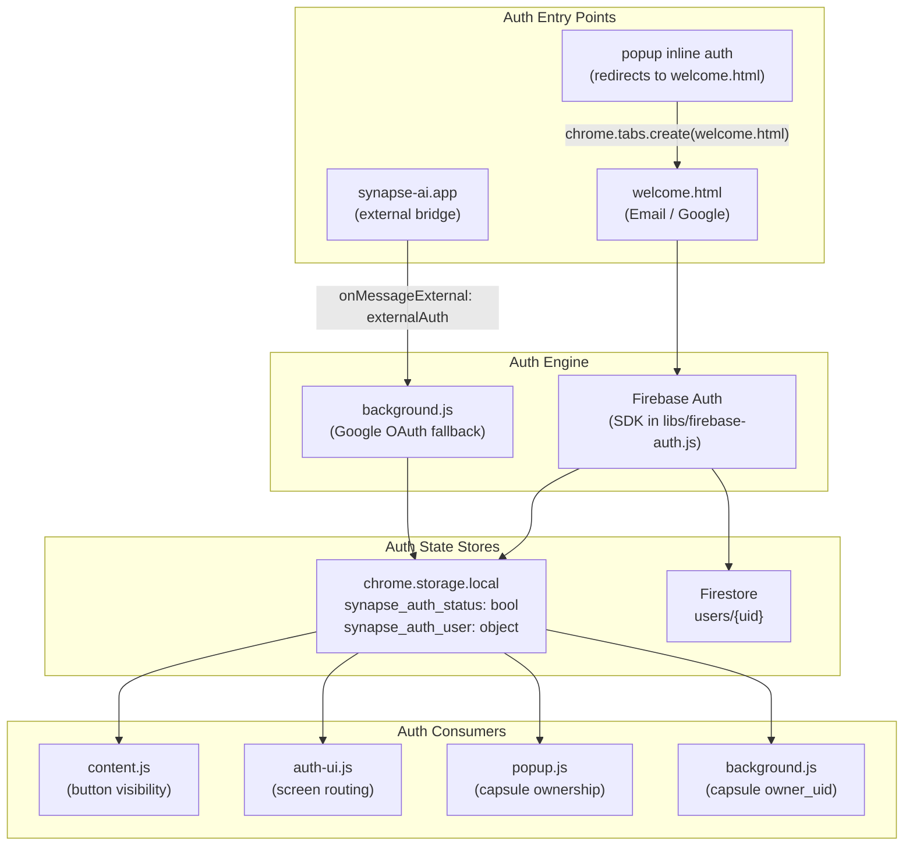
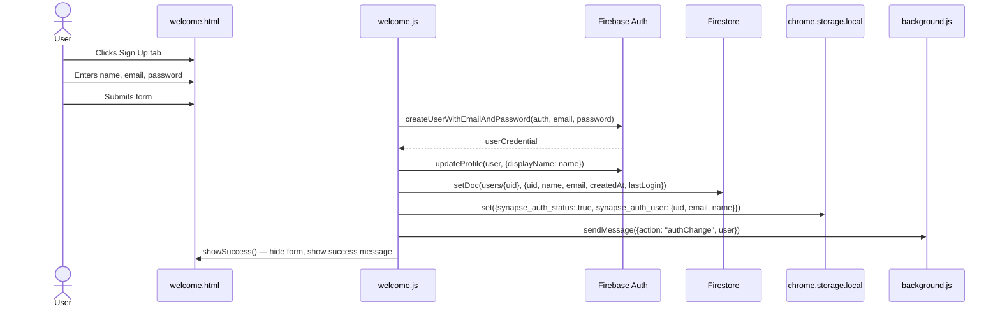
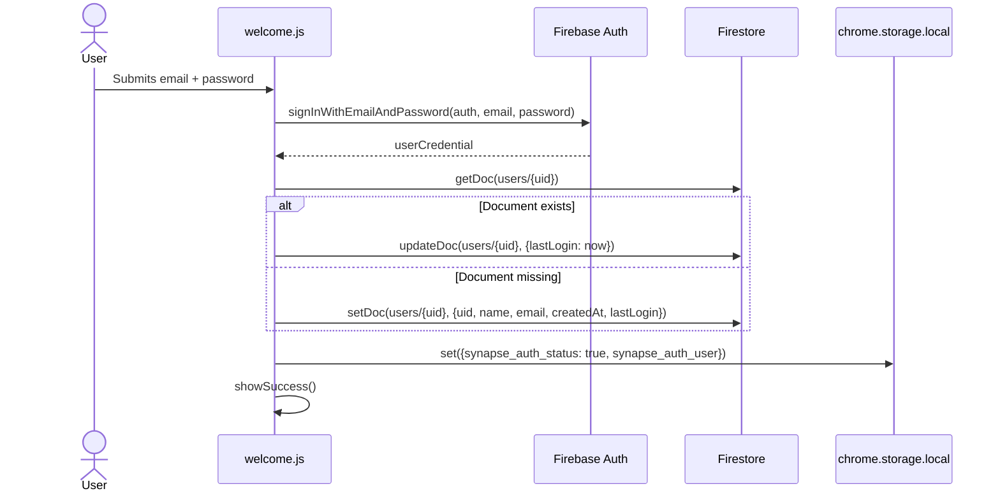
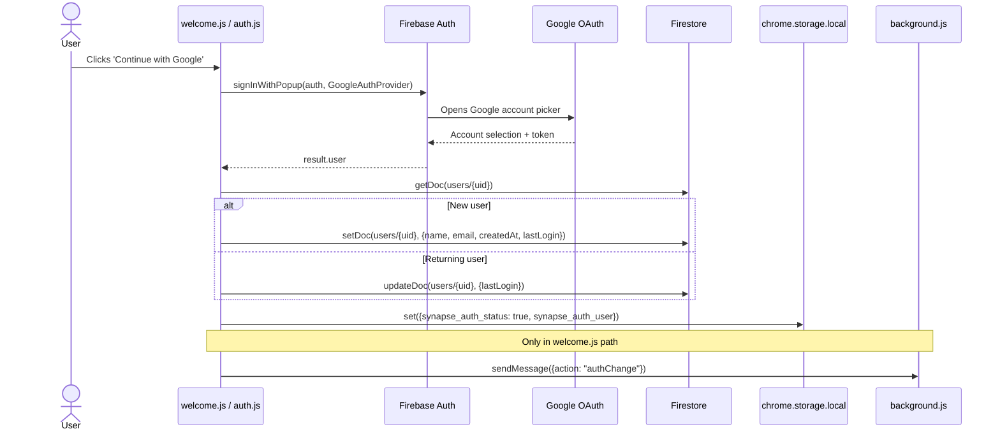
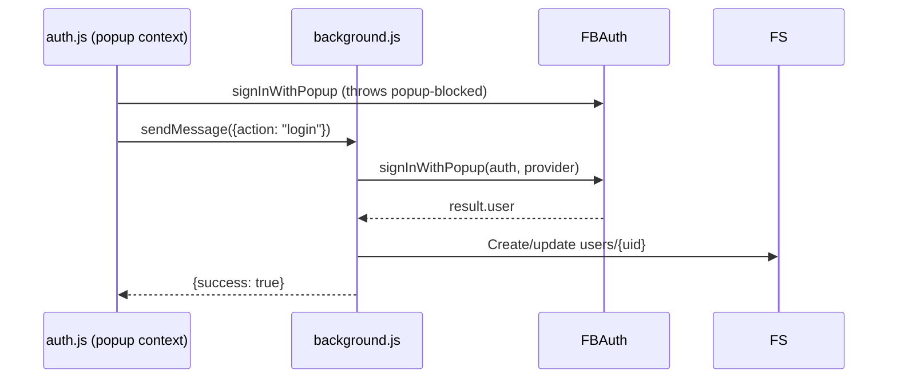
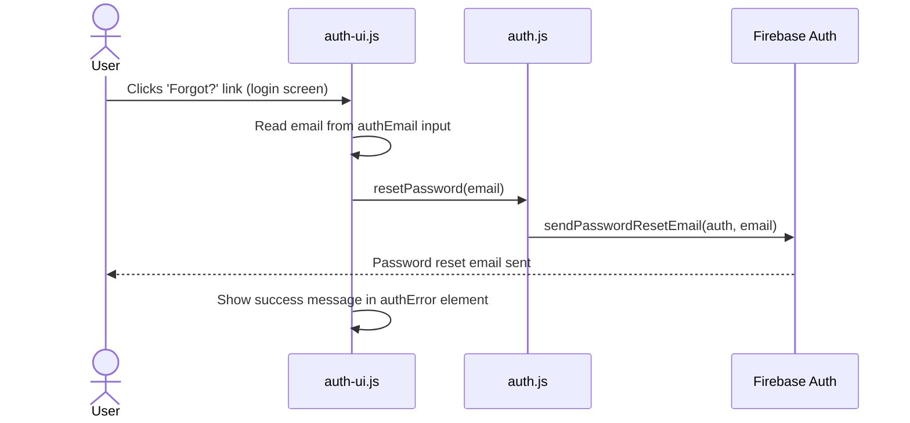
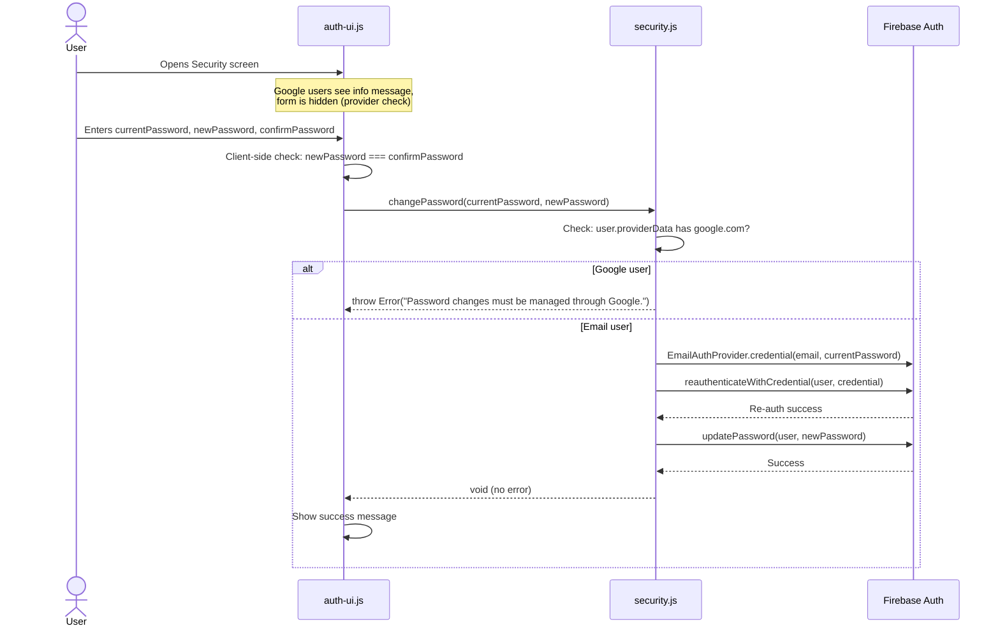
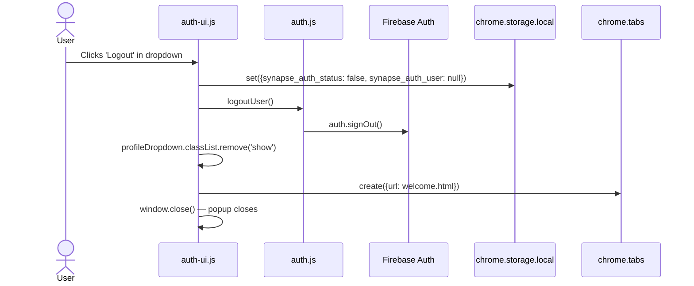
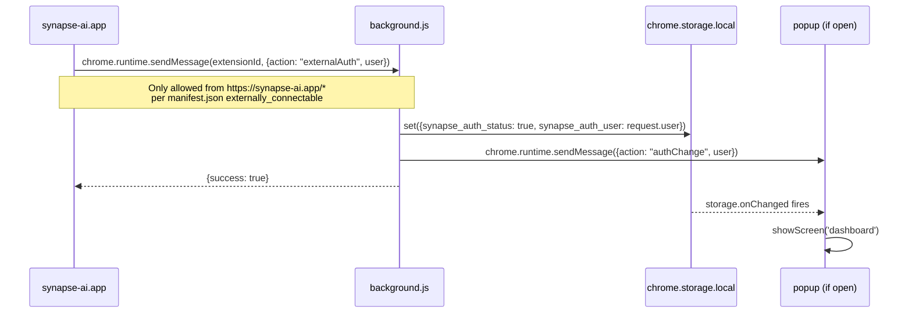
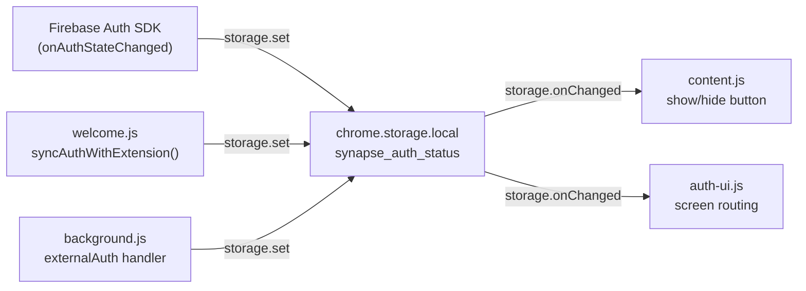

# Authentication — Synapse AI Link

> All authentication flows documented here reflect actual code implementation.

---

## Authentication Architecture Overview



---

## Auth Provider Support

| Provider | Implementation | User Data Source |
|---|---|---|
| Email / Password | `signInWithEmailAndPassword`, `createUserWithEmailAndPassword` | `users/{uid}` in Firestore |
| Google OAuth | `signInWithPopup(auth, GoogleAuthProvider)` | `users/{uid}` in Firestore |
| External (synapse-ai.app) | `chrome.runtime.onMessageExternal` | Passed in message payload |

---

## Flow 1: Email Registration



---

## Flow 2: Email Login



---

## Flow 3: Google OAuth Login



**Fallback path (if popup blocked in extension context):**


---

## Flow 4: Password Reset (Forgot Password)



---

## Flow 5: Password Change (Security Screen)



---

## Flow 6: Logout



---

## Flow 7: External Auth Bridge (synapse-ai.app)



---

## Session Management

### Token Handling

Firebase Auth manages token refresh automatically via the Firebase Auth SDK. The extension does **not** manually handle JWT tokens. Token state is maintained by the Firebase SDK internally using IndexedDB persistence.

### Auth State in Extension Storage

The boolean flag `synapse_auth_status` in `chrome.storage.local` acts as a **lightweight auth gate** for content scripts and popup routing. It is NOT a security token — it is a UI hint.

**Important:** Firebase Auth token validity is enforced at the Firebase SDK level for all Firestore and Auth API calls. The local storage flag only controls UI visibility.

### Cross-Context Auth Sync



### Service Worker Cold Start

Background.js `getCurrentUserAsync()` handles the case where the service worker restarts and Firebase Auth has not yet restored from IndexedDB:

```javascript
function getCurrentUserAsync() {
    return new Promise((resolve) => {
        if (auth.currentUser) {
            resolve(auth.currentUser);  // Already available
            return;
        }
        // Wait for onAuthStateChanged to fire after IndexedDB restore
        const unsubscribe = auth.onAuthStateChanged((user) => {
            unsubscribe();
            resolve(user);
        });
        // Hard timeout: resolve with whatever is available after 1 second
        setTimeout(() => {
            resolve(auth.currentUser);
        }, 1000);
    });
}
```

---

## Security Notes (From Code Analysis)

| Finding | Location | Impact |
|---|---|---|
| Groq API key hardcoded in source | `background.js` line 22, `content.js` line 4 | High — key visible to any user inspecting extension via `chrome://extensions` |
| Firebase config hardcoded | `popup/firebase.js` | Medium-Low — standard for client Firebase; security depends on Firestore Security Rules |
| Firestore Security Rules not present in repo | Not found in codebase | High — data access enforced at application level only via `owner_uid` field filtering |
| External auth bypass via `externalAuth` | `background.js` | Medium — any page at `synapse-ai.app/*` can set auth status without Firebase token validation |
| Provider check in security.js prevents Google users from changing password via email form | `popup/security.js` | Good — prevents cross-provider auth confusion |
| Reauthentication required before password change | `popup/security.js` | Good — mitigates account takeover via unattended session |
