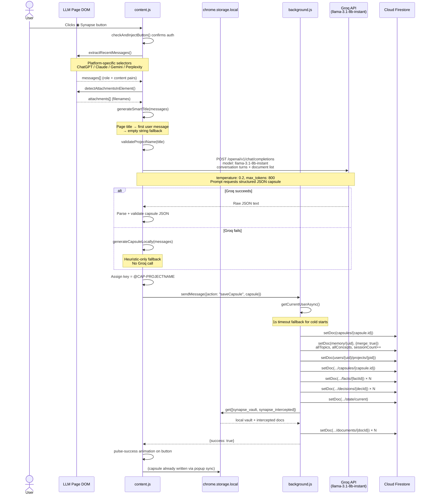
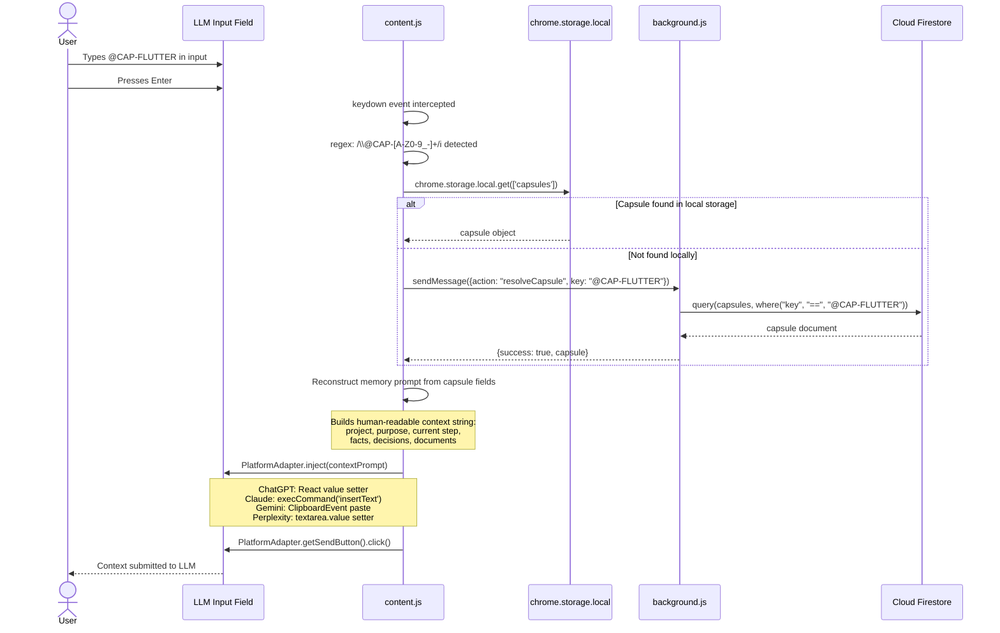
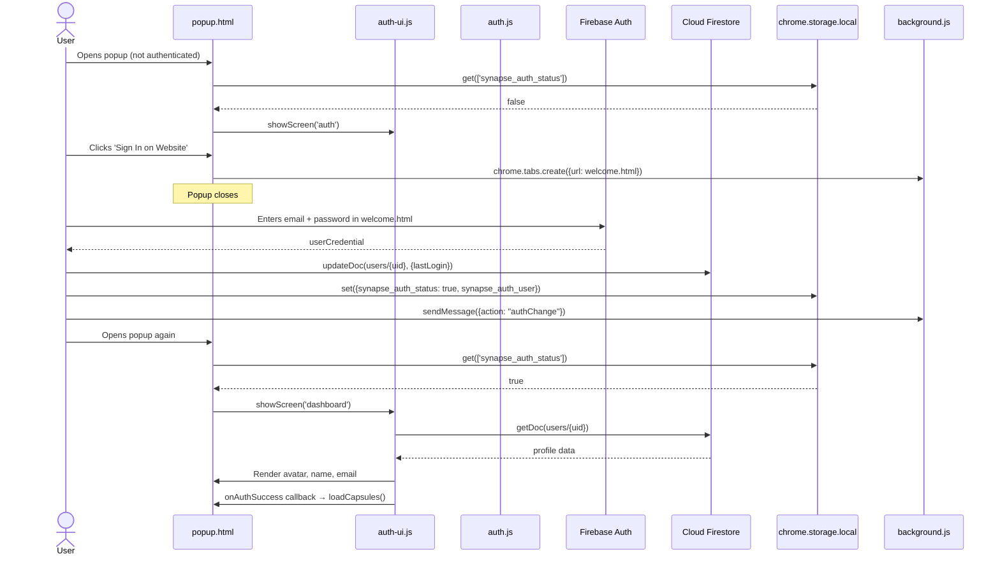
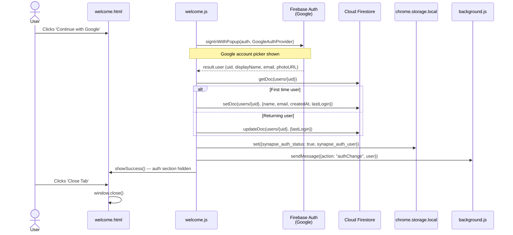
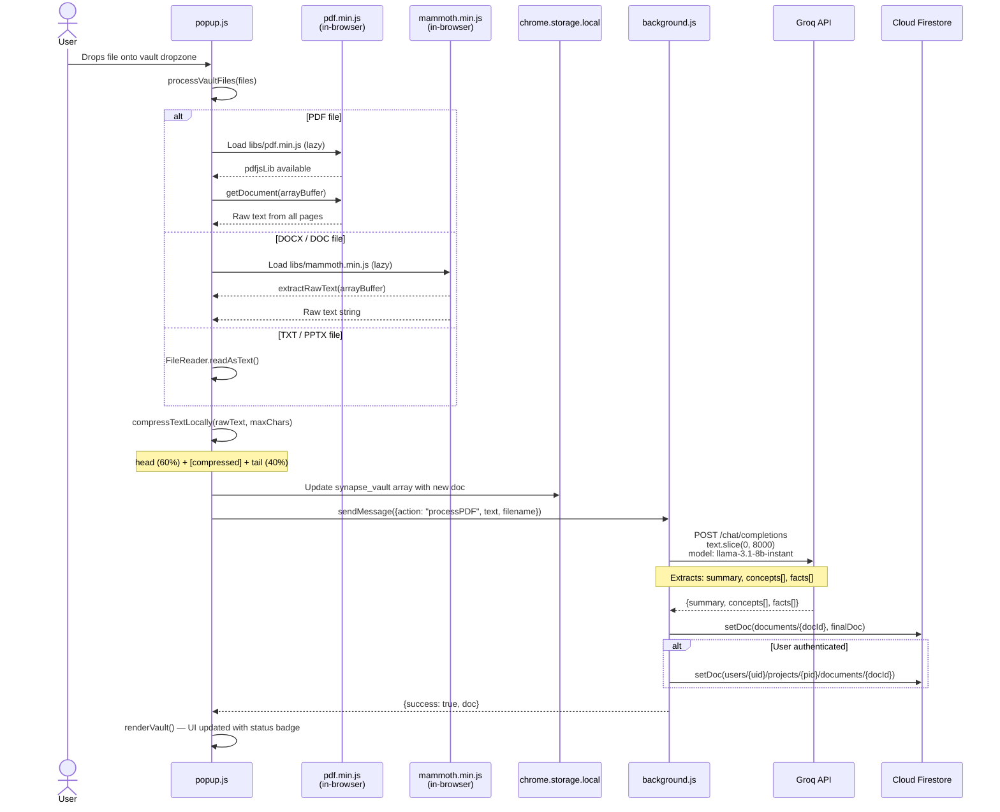
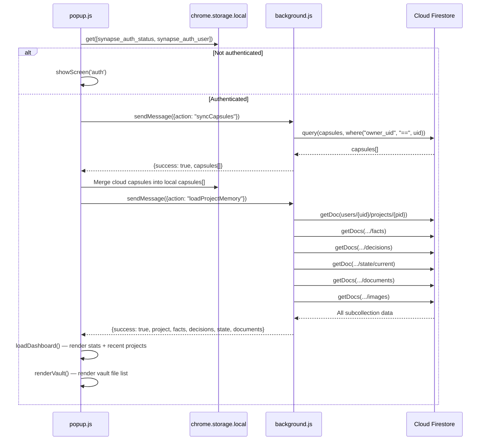
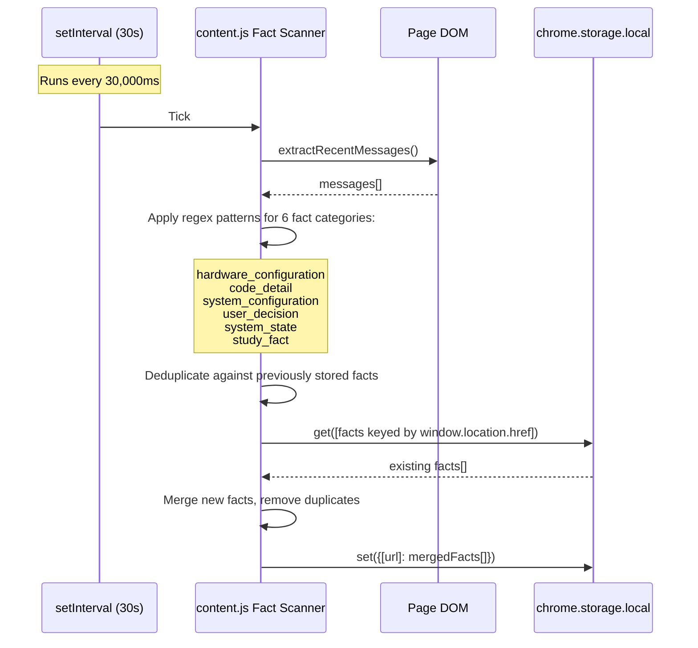
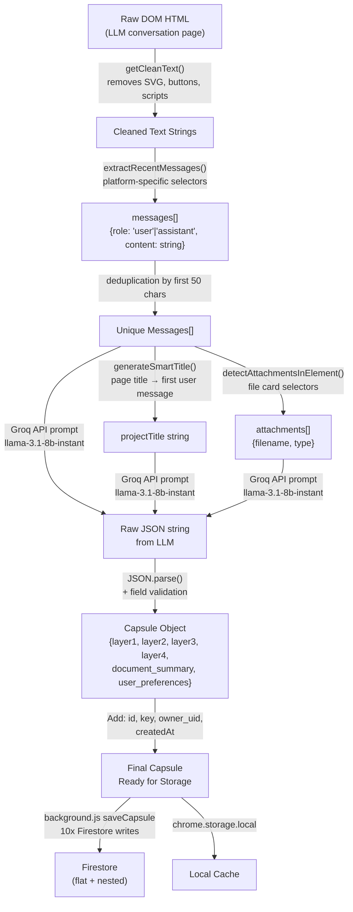

# Data Flow — Synapse AI Link

> All flows verified from actual code. No assumed behavior documented.

---

## Overview

Data in Synapse AI Link flows through five primary paths:

1. **Capsule Generation** — Conversation → Groq → Firestore + Local Storage
2. **Capsule Injection** — `@CAP-KEY` → Local/Firestore lookup → LLM input
3. **Authentication** — User credentials → Firebase Auth → Extension storage
4. **Document Vault** — File upload → In-browser parse → Groq → Firestore
5. **Dashboard Sync** — Firestore read → Local storage → Popup UI

---

## Flow 1: Capsule Generation

---

## Flow 2: Capsule Injection

---

## Flow 3: Authentication (Email/Password)

---

## Flow 4: Authentication (Google OAuth)

---

## Flow 5: Document Vault Upload

---

## Flow 6: Popup Dashboard Sync

---

## Flow 7: Background Fact Scanner

---

## Data Transformation: Raw Conversation → Capsule JSON

