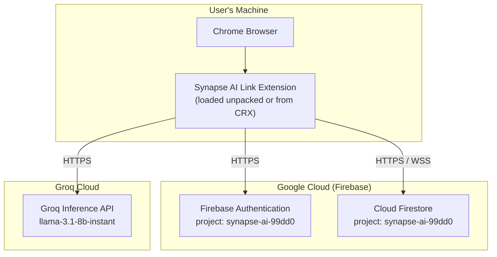

# Deployment — Synapse AI Link

> All deployment details derived from manifest.json, package.json, firebase.js, and repository structure.

---

## Deployment Overview

Synapse AI Link has **no custom backend server**. The deployment surface is:

1. **Chrome Extension** — packaged and distributed as a `.crx` or loaded unpacked
2. **Firebase Project** — `synapse-ai-99dd0` on Google Cloud (Auth + Firestore)
3. **Groq API** — external hosted LLM inference (no deployment required)



---

## Extension Packaging

### Current Method (Development)

The extension is currently loaded as an **unpacked extension** via Chrome Developer Mode:

```
1. Open Chrome → chrome://extensions
2. Enable "Developer mode" (top right toggle)
3. Click "Load unpacked"
4. Select the HTK-AI-Capsule folder
```

### Production Packaging

To distribute as a `.crx` file:

```
1. Open Chrome → chrome://extensions
2. Enable "Developer mode"
3. Click "Pack extension"
4. Set Extension root directory: /path/to/HTK-AI-Capsule
5. Chrome generates HTK-AI-Capsule.crx + HTK-AI-Capsule.pem (private key)
```

> **Note:** For Chrome Web Store distribution, submit the extension ZIP (not .crx) through the Chrome Developer Dashboard at https://chrome.google.com/webstore/devconsole

### Files Required in Extension Package

All of the following must be present in the packaged extension:

```
manifest.json          ← Required — extension blueprint
background.js          ← Required — service worker
content.js             ← Required — content script
welcome.html           ← Required — onboarding page
welcome.js             ← Required — onboarding auth
welcome.css            ← Required — onboarding styles
popup/
  popup.html           ← Required — extension popup
  popup.js             ← Required — popup controller
  firebase.js          ← Required — Firebase SDK init
  auth.js              ← Required — auth functions
  auth-ui.js           ← Required — screen router
  profile.js           ← Required — profile CRUD
  security.js          ← Required — password management
libs/
  pdf.min.js           ← Required — PDF parsing
  pdf.worker.min.js    ← Required — PDF parsing worker
  mammoth.min.js       ← Required — DOCX parsing
  firebase/
    firebase-app.js    ← Required — Firebase App SDK
    firebase-auth.js   ← Required — Firebase Auth SDK
    firebase-firestore.js ← Required — Firestore SDK
```

### Files to EXCLUDE from package

```
chrome-profile/        ← Browser profile data — not part of extension
archived/              ← Deprecated/unused files
scratch/               ← Dev-only test scripts
docs/                  ← Documentation — not needed at runtime
readme/                ← Documentation — not needed at runtime
.git/                  ← Git history
node_modules/          ← npm packages not used by extension runtime
package.json           ← Not needed at runtime
package-lock.json      ← Not needed at runtime
.gitattributes         ← Not needed at runtime
chrome.log             ← Dev log file
```

---

## Firebase Configuration

### Project Details

| Setting | Value |
|---|---|
| Project ID | `synapse-ai-99dd0` |
| Auth Domain | `synapse-ai-99dd0.firebaseapp.com` |
| Storage Bucket | `synapse-ai-99dd0.firebasestorage.app` |
| Messaging Sender ID | `57638029332` |
| App ID | `1:57638029332:web:e26efcb030f017aaf0bf01` |
| Measurement ID | `G-GW8K0SW5HD` |

**Source:** `popup/firebase.js`

### Firebase Services Used

| Service | Purpose | Configuration Location |
|---|---|---|
| Firebase Authentication | Email/Password + Google OAuth | Firebase Console → Authentication |
| Cloud Firestore | All persistent storage | Firebase Console → Firestore Database |
| Google Analytics (optional) | `measurementId: G-GW8K0SW5HD` present | Firebase Console → Analytics |

### Required Firebase Console Setup

**Authentication Providers to enable:**
- Email/Password — native Firebase provider
- Google — OAuth provider (requires OAuth consent screen in Google Cloud Console)

**Firestore Database:**
- Create database in production mode
- Region: not specified in code — defaults to `us-central1` for new projects
- Security Rules: **not present in repository** — must be configured before production use

**Recommended Firestore Security Rules (not in repo, but required):**
```javascript
// NOTE: These rules are NOT in the codebase.
// They represent what the application logic expects.
rules_version = '2';
service cloud.firestore {
  match /databases/{database}/documents {
    // Users can only read/write their own profile
    match /users/{uid} {
      allow read, write: if request.auth.uid == uid;
      match /{subcollection=**} {
        allow read, write: if request.auth.uid == uid;
      }
    }
    // Capsules owned by the authenticated user
    match /capsules/{capsuleId} {
      allow read: if request.auth != null 
                  && resource.data.owner_uid == request.auth.uid;
      allow write: if request.auth != null 
                   && request.resource.data.owner_uid == request.auth.uid;
      allow read: if resource.data.owner_uid == 'anonymous';
    }
    // Memory documents per user
    match /memory/{uid} {
      allow read, write: if request.auth.uid == uid;
    }
    // Documents collection
    match /documents/{docId} {
      allow read, write: if request.auth != null;
    }
  }
}
```

---

## Environment Variables

There are **no environment variable files** (`.env`) in the repository. All configuration is hardcoded in source files:

| Variable | Hardcoded Location | Value |
|---|---|---|
| Groq API Key | `background.js` line 22 | `gsk_lP4NSJv...` |
| Groq API Key (duplicate) | `content.js` line 4 | Same key |
| Firebase API Key | `popup/firebase.js` | `AIzaSyDbmFyO...` |
| Firebase Project ID | `popup/firebase.js` | `synapse-ai-99dd0` |
| Firebase App ID | `popup/firebase.js` | `1:57638029332:web:...` |

> **Security note:** The Groq API key is embedded in the extension source and is visible to any user who inspects the extension files. For production, this key should be proxied through a server-side endpoint or rotated to a key with usage limits applied.

---

## Dependencies

### Runtime Dependencies (Extension)

All runtime dependencies are **bundled locally** — no npm packages are used at runtime:

| Library | Local Path | Purpose |
|---|---|---|
| Firebase App SDK | `libs/firebase/firebase-app.js` | Firebase initialization |
| Firebase Auth SDK | `libs/firebase/firebase-auth.js` | Authentication |
| Firebase Firestore SDK | `libs/firebase/firebase-firestore.js` | Database |
| PDF.js | `libs/pdf.min.js` + `pdf.worker.min.js` | PDF text extraction |
| Mammoth.js | `libs/mammoth.min.js` | DOCX text extraction |

### Development Dependencies

| Package | Purpose | Location |
|---|---|---|
| `firebase ^12.13.0` | Firebase JS SDK source | `node_modules/` (not bundled) |
| `puppeteer-core` | E2E testing | `node_modules/`, `scratch/e2e_verification.js` |

---

## Build Process

There is **no build step** in this project. The extension runs directly from source files with no transpilation, bundling, or compilation.

```
Source Files → Chrome Extension (direct, no build)
```

### Install Steps

```bash
# 1. Clone repository
git clone <repo-url>
cd HTK-AI-Capsule

# 2. Install dev dependencies (optional, only needed for E2E tests)
npm install

# 3. Load extension in Chrome
# chrome://extensions → Developer mode → Load unpacked → select folder
```

---

## Externally Connectable Domain

The manifest declares `externally_connectable` for `https://synapse-ai.app/*`. This domain is referenced in code but the web app at that domain is **not present in this repository**.

```json
"externally_connectable": {
  "matches": ["https://synapse-ai.app/*"]
}
```

This allows JavaScript running on `synapse-ai.app` to call `chrome.runtime.sendMessage(extensionId, ...)` directly to the background service worker.

---

## Host Permissions Summary

The extension declares the following `host_permissions` in `manifest.json`:

| Domain | Purpose |
|---|---|
| `https://chatgpt.com/*` | Content script injection + LLM interaction |
| `https://chat.openai.com/*` | ChatGPT alternate domain |
| `https://claude.ai/*` | Content script injection + LLM interaction |
| `https://gemini.google.com/*` | Content script injection + LLM interaction |
| `https://www.perplexity.ai/*` | Content script injection + LLM interaction |
| `https://*.firebaseapp.com/*` | Firebase Auth domain |
| `https://*.identitytoolkit.googleapis.com/*` | Firebase Auth API |
| `https://*.firestore.googleapis.com/*` | Firestore REST API |
| `https://*.firebaseio.com/*` | Firebase Realtime legacy |
| `https://*.googleapis.com/*` | Google APIs (broad) |
| `wss://*.firestore.googleapis.com/*` | Firestore WebSocket (real-time) |
| `https://api.groq.com/*` | Groq inference API |

---

## Chrome Web Store Submission Checklist

Based on the codebase, the following items would be needed before a Chrome Web Store submission:

- [ ] Remove or proxy hardcoded Groq API key
- [ ] Add privacy policy URL (required by Chrome Web Store for extensions using remote data)
- [ ] Add extension icons (16px, 48px, 128px) — not found in current repository
- [ ] Configure Firestore Security Rules
- [ ] Remove `test_collection` dev artifact from `background.js`
- [ ] Set `content_security_policy` if needed for MV3 compliance
- [ ] Verify all `host_permissions` are justified in store listing
