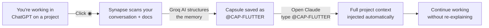
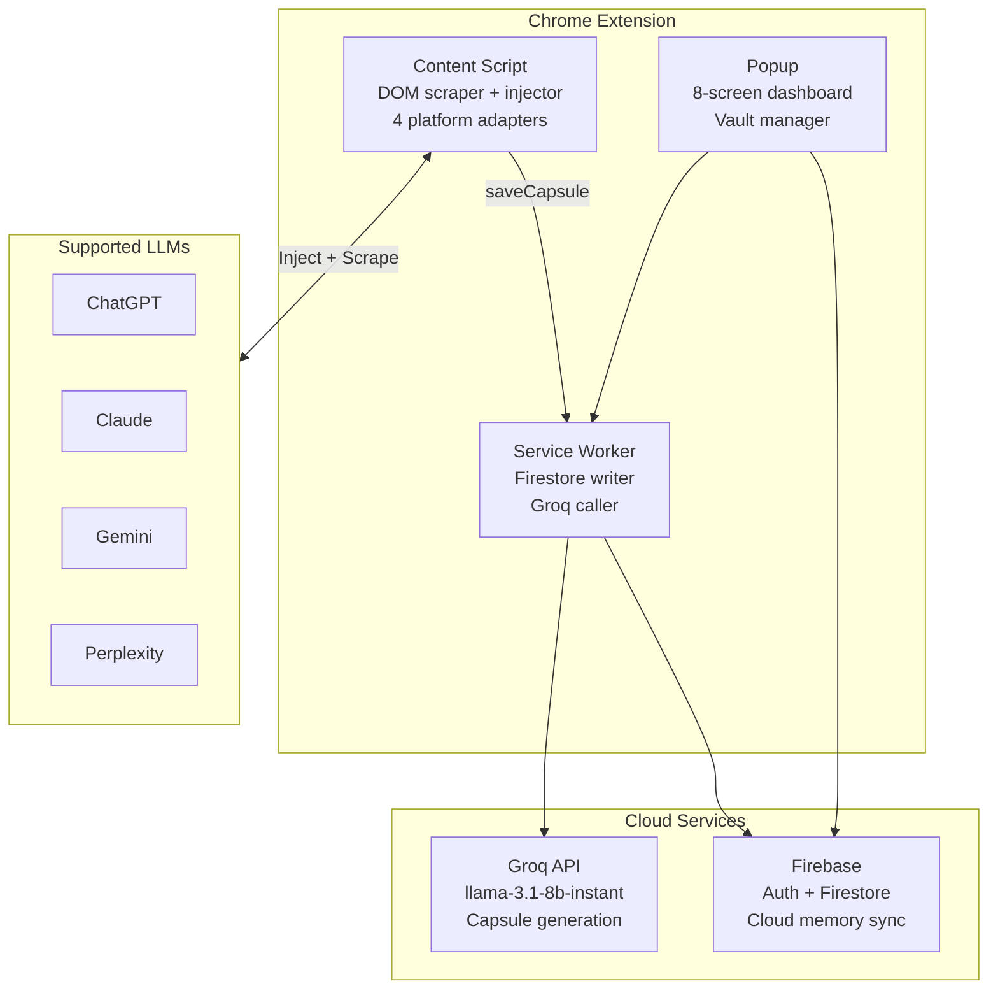

# Hackathon Presentation — Synapse AI Link

> Project overview for judges, evaluators, and demo audiences.
> All claims are backed by actual implemented code in the repository.

---

## Elevator Pitch

> **"Every AI conversation starts from zero. Synapse fixes that."**

Synapse AI Link is a Chrome extension that captures your AI conversations as structured memory capsules and lets you inject that context into any AI platform — instantly, with a single `@CAP-KEY` reference.

Work on a Flutter project in ChatGPT. Switch to Claude. Type `@CAP-FLUTTER`. Your entire project context — architecture, current step, decisions, documents — lands in the input and submits. No copy-pasting. No re-explaining. No lost progress.

---

## The Problem

Modern AI assistants are stateless. Every new session starts blank. Every platform switch means re-explaining your entire project from scratch.

| Pain Point | Frequency |
|---|---|
| "Let me re-explain my project..." | Every new chat |
| Copy-pasting context between tools | Multiple times per day |
| Switching from ChatGPT to Claude mid-project | Loses all prior context |
| Uploading documents again on each platform | Every session |
| Forgetting what you decided last session | Constantly |

This is a universal problem for every developer, student, and knowledge worker who uses AI tools.

---

## The Solution

Synapse AI Link introduces the concept of an **AI Context Capsule** — a structured, portable memory object that travels with you across AI platforms.

```
Save once.  Recall anywhere.  Work continuously.
```

### How It Works



---

## Live Demo Script

### Step 1 — Capture (30 seconds)
1. Open ChatGPT with an ongoing project conversation
2. Point to the ◉ Synapse button injected in the input bar
3. Click it → popover appears with auto-detected project title
4. Click **Generate** → loading animation cycles through "Building Memory... Extracting Facts..."
5. Capsule saved: `@CAP-FLUTTER-APP`

### Step 2 — Recall (15 seconds)
1. Open Claude in a new tab
2. In the input box, type `@CAP-FLUTTER-APP`
3. Press Enter
4. Watch the full project context auto-inject and submit to Claude

### Step 3 — Vault (15 seconds)
1. Open popup → Main App screen
2. Drop a PDF datasheet onto the vault dropzone
3. Show it processing: "Groq is extracting concepts and facts..."
4. Show the document now available to include in future capsules

---

## Technical Architecture



### Key Technical Decisions

| Decision | Rationale |
|---|---|
| No custom backend server | Firebase + Groq cover all needs; zero deployment overhead |
| Local SDK copies (not CDN) | Chrome Extension CSP blocks remote scripts |
| Local-first capsule reads | Capsule injection on Enter must be instant |
| Head+tail text compression | Preserves document intro (60%) + conclusion (40%) for AI |
| Dual Firestore write (flat + nested) | Flat for fast key resolution; nested for project-scoped queries |
| Groq `llama-3.1-8b-instant` | Sub-second inference; structured JSON output |
| 30-second background fact scanner | Continuously builds project memory without user action |

---

## What Makes This Innovative

### 1. Cross-Platform Memory Bridge
No other tool lets you save context from one AI and recall it in another with a typed keyword. This is a new interaction primitive.

### 2. Structured AI Memory (Not Just Text)
Capsules are not raw text dumps. They are semantically structured JSON with distinct layers for identity, architecture, state, facts, and document context — produced by an LLM that understands the conversation.

### 3. Four Live DOM Adapters
Each LLM platform uses a completely different editor technology. Synapse implements:
- React synthetic event injection (ChatGPT)
- ProseMirror `execCommand` (Claude)
- ClipboardEvent paste (Gemini)
- Native textarea injection (Perplexity)

This is non-trivial reverse engineering of four live production applications.

### 4. In-Browser Document Intelligence
PDF and DOCX files are parsed entirely in-browser using PDF.js and Mammoth.js — no upload to any custom server. Groq then extracts structured knowledge from them.

### 5. Persistent Background Memory
The 30-second fact scanner runs continuously while the user works, building a categorized knowledge base (`hardware_configuration`, `code_detail`, `user_decision`, etc.) without any user interaction.

---

## System Metrics

| Metric | Value |
|---|---|
| Supported LLM platforms | 4 (ChatGPT, Claude, Gemini, Perplexity) |
| DOM selector fallback layers | 3–4 per platform |
| Firestore writes per capsule save | Up to 10 |
| Capsule memory layers | 6 (identity, architecture, state, facts, documents, preferences) |
| PDF text cap for AI | 8,000 characters |
| Fact scanner interval | 30 seconds |
| Fact categories | 6 |
| Popup screens | 8 |
| Extension permissions | 4 (activeTab, storage, scripting, tabs) |
| External API dependencies | 2 (Firebase, Groq) |

---

## Judge Scoring Breakdown

### Architecture Clarity — 8/10
The system has clean module separation: content script, service worker, popup module, auth module, vault module, Firebase layer. Message passing contracts are explicit and consistent.

**What works well:** Local-first reads, dual-write strategy, platform adapter pattern
**What could improve:** `content.js` is 5,000+ lines — should be modularized; auth logic is split across two paths

---

### Technical Depth — 9/10
This extension does genuinely difficult engineering: reverse-engineering four live LLM DOM structures with multi-layer fallbacks, implementing four different editor injection techniques, building a background semantic memory system, and integrating AI-powered document understanding.

**What works well:** Multi-fallback DOM selectors, platform-specific injection methods, Groq-structured capsule generation, in-browser PDF/DOCX parsing
**What could improve:** Sequential Firestore writes (10 per save) should use `writeBatch()`

---

### Scalability — 6/10
The architecture is serverless and scales well for individual users. However, multi-user scale surfaces concerns: sequential writes are expensive, there are no visible Firestore Security Rules, and the Groq key is shared across all users.

**What works well:** Firebase auto-scales; local-first reads reduce Firestore pressure
**What could improve:** Batch writes, server-side Groq proxy, Firestore Security Rules

---

### Innovation — 9/10
The core concept — portable AI memory with keyboard recall across platforms — is a genuinely novel interaction model. The implementation spans four live production LLM platforms with per-platform DOM engineering and structured AI memory generation.

**What works well:** The `@CAP-KEY` recall UX is elegant and immediately understandable
**What could improve:** The capsule injection experience could be more visual/confirmatory

---

## Future Vision

Based on existing architecture and patterns found in the codebase:

| Version | Direction |
|---|---|
| **v1.1** | Firestore Security Rules, Groq key proxy, `writeBatch` performance |
| **v2.0** | Real-time capsule collaboration (Firestore `onSnapshot`), capsule sharing via key |
| **v3.0** | Browser-native memory (without LLM platforms), direct API integrations |

---

## Creator

**Hamza Taif (HTK)**
Lead Developer

> *"The problem isn't that AI forgets — it's that we've accepted it as normal. Synapse changes that."*

---

## One-Line Summary for Judges

> A Chrome extension that turns any AI conversation into a portable, structured memory capsule you can inject into any other AI platform with a single `@CAP-KEY` reference — built with Groq AI, Firebase, and four custom LLM DOM adapters.
