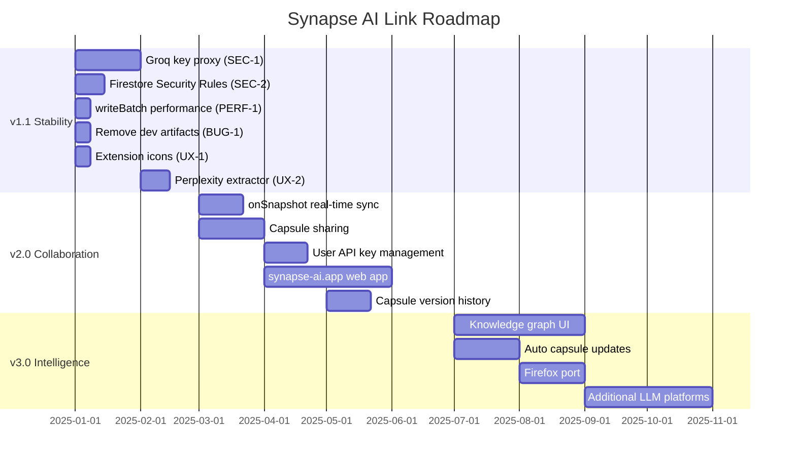

# Roadmap — Synapse AI Link

> Roadmap items are derived exclusively from:
> 1. Incomplete or placeholder code found in the repository
> 2. Known issues identified during codebase analysis
> 3. Architecture patterns present in the code that suggest natural next steps
>
> No features are invented. Every item traces back to a code finding.

---

## Current Version — v1.0 (Implemented)

These are fully implemented features confirmed in the codebase:

| Feature | Evidence |
|---|---|
| Capsule generation via Groq (`llama-3.1-8b-instant`) | `content.js` → `generateCapsule()` |
| Local fallback capsule generation | `content.js` → `generateCapsuleLocally()` |
| `@CAP-KEY` capsule injection into LLMs | `content.js` → Enter keypress handler |
| 4-platform DOM scrapers (ChatGPT, Claude, Gemini, Perplexity) | `content.js` → `extractRecentMessages()` |
| 4-platform adapter injection (React, ProseMirror, Quill, textarea) | `content.js` → `PlatformAdapters` |
| Background fact scanner (30s interval, 6 categories) | `content.js` → fact scanner |
| Document Vault (PDF, DOCX, PPTX, TXT) | `popup/popup.js` → `processVaultFiles()` |
| In-browser PDF extraction (PDF.js) | `libs/pdf.min.js` |
| In-browser DOCX extraction (Mammoth.js) | `libs/mammoth.min.js` |
| AI-powered PDF summarization via Groq | `background.js` → `processPDF` |
| Firebase Auth (email/password + Google OAuth) | `popup/auth.js`, `welcome.js` |
| Cloud Firestore sync (capsules, memory, documents, projects) | `background.js` → all handlers |
| 8-screen popup dashboard | `popup/popup.html`, `popup/auth-ui.js` |
| Password change with reauthentication | `popup/security.js` |
| Password reset via email | `popup/auth.js` → `resetPassword()` |
| Offline detection banner | `popup/popup.js` → `updateOfflineStatus()` |
| Capsule deletion (local + cloud) | `popup/popup.js` → `deleteCapsule()` |
| External auth bridge (`synapse-ai.app`) | `background.js` → `onMessageExternal` |
| Welcome/onboarding page on first install | `background.js` → `onInstalled` |
| Memory Inspector modal (in-page) | `content.js` → Inspector modal CSS + HTML |
| Document selector for capsule generation | `popup/popup.js` → `showDocumentSelector()` |
| Head+tail text compression | `popup/popup.js` → `compressTextLocally()` |
| Semantic memory summary per user | `background.js` → `memory/{uid}` write |
| Project subcollection hierarchy | `background.js` → project sync block |
| Dashboard stats (projects, documents, facts, capsules) | `popup/popup.html` → stat grid |

---

## Version 1.1 — Stability & Security

> Based on: identified bugs, security gaps, and performance issues found in code analysis.

### SEC-1 — Rotate and Proxy Groq API Key
**Finding:** Groq API key is hardcoded in `background.js` (line 22) and `content.js` (line 4), visible to any user who inspects extension source files.
**Work:** Create a server-side proxy endpoint (e.g., Firebase Cloud Function) that accepts capsule generation requests and calls Groq internally. Remove key from extension source.
**Files affected:** `background.js`, `content.js`, new Cloud Function

### SEC-2 — Add Firestore Security Rules
**Finding:** No Firestore Security Rules are present in the repository. All access control is application-level only (`owner_uid` field filtering).
**Work:** Write and deploy Firestore Security Rules enforcing that users can only read/write documents where `owner_uid == request.auth.uid`.
**Files affected:** New `firestore.rules` file, Firebase Console deployment

### PERF-1 — Replace Sequential Firestore Writes with writeBatch
**Finding:** `background.js` → `saveCapsule` handler performs up to 10 sequential `await setDoc()` calls. Each is a separate network round-trip.
**Work:** Replace the sequential writes with a single `writeBatch()` containing all document writes. Reduces save latency significantly.
**Files affected:** `background.js` → `saveCapsule` handler

### BUG-1 — Remove test_collection Dev Artifact
**Finding:** `background.js` contains `testFirestoreConnection()` which writes to `test_collection/test_connection` in production Firestore. Function exists but is commented out from auto-run — still callable.
**Work:** Remove `testFirestoreConnection()` function and `test_collection` writes entirely.
**Files affected:** `background.js`

### BUG-2 — Deduplicate Groq API Key Definition
**Finding:** `GROQ_API_KEY` is defined identically in both `background.js` (line 22) and `content.js` (line 4). Two separate hardcoded values that must stay in sync.
**Work:** Once proxied (SEC-1), both definitions are removed. Until then, consolidate to a single shared config module.
**Files affected:** `background.js`, `content.js`

### UX-1 — Add Extension Icons
**Finding:** No icon files (`icon16.png`, `icon48.png`, `icon128.png`) are present in the repository. The manifest does not declare an `icons` field. Chrome Web Store requires icons.
**Work:** Add extension icon assets and declare them in `manifest.json` under `icons` and `action.default_icon`.
**Files affected:** New icon assets, `manifest.json`

### UX-2 — Perplexity DOM Extractor
**Finding:** `extractRecentMessages()` in `content.js` has ChatGPT, Gemini, and Claude branches with specific selectors. Perplexity falls through to a generic class-based fallback (`[class*="message"]`) with no dedicated branch.
**Work:** Add a dedicated Perplexity extraction branch with platform-specific selectors.
**Files affected:** `content.js` → `extractRecentMessages()`

---

## Version 2.0 — Collaboration & Sharing

> Based on: existing Firestore architecture that supports per-user data, the `externally_connectable` setup suggesting a web companion, and the `onSnapshot` import present but unused in `popup/firebase.js`.

### FEAT-1 — Real-Time Capsule Sync with onSnapshot
**Finding:** `onSnapshot` is imported and exported in `popup/firebase.js` but is **not used anywhere** in the current codebase. The infrastructure for real-time Firestore listeners is already included.
**Work:** Replace the one-shot `getDocs` sync in `popup/popup.js` → `syncWithCloud()` with an `onSnapshot` listener on the user's `capsules` collection. Popup updates in real-time when capsules are added from other devices or tabs.
**Files affected:** `popup/popup.js`, `popup/firebase.js`

### FEAT-2 — Capsule Sharing via Key
**Finding:** Capsules have a `key` field (`@CAP-PROJECTNAME`) and are stored in a flat `capsules` collection queryable by key. The `resolveCapsule` handler in `background.js` already queries by key without requiring `owner_uid` match.
**Work:** Add a "Share" button in the popup capsule list that copies a public share URL or key. Allow users to resolve capsules they did not create by key lookup. Add optional `isPublic` flag to capsule Firestore document.
**Files affected:** `popup/popup.html`, `popup/popup.js`, `background.js` → `resolveCapsule`

### FEAT-3 — Groq/Gemini API Key Integration (User-Provided)
**Finding:** `popup/popup.js` contains this comment:
```javascript
// 3. API key management functions
// (Left intentionally blank for future Groq/Gemini key integration)
```
This is an explicit placeholder in the codebase for user-managed API keys.
**Work:** Add an API key settings screen to the popup where users can enter their own Groq or Gemini API keys. Store encrypted in `chrome.storage.local`. Use user key when present, fall back to shared proxy.
**Files affected:** `popup/popup.js` (section 3 placeholder), `popup/popup.html` (new settings screen)

### FEAT-4 — Synapse Web App (`synapse-ai.app`)
**Finding:** `manifest.json` declares `externally_connectable: { matches: ["https://synapse-ai.app/*"] }` and `background.js` handles `externalAuth` messages from that domain. The domain is referenced but the web app is **not in this repository**.
**Work:** Build the companion web app at `synapse-ai.app` that handles auth (already wired via `externalAuth`), displays the user's capsule library, and allows capsule management from a browser without the extension popup size constraint.
**Files affected:** New web app project (separate repo), `background.js` `externalAuth` handler already complete

### FEAT-5 — Capsule Version History
**Finding:** Each `saveCapsule` call to `users/{uid}/projects/{pid}/capsules/{capsuleId}` overwrites the existing document. Multiple capsule saves for the same project overwrite rather than append.
**Work:** Change the capsule save strategy for project subcollections to use a timestamped ID, enabling version history. Add a "History" view in the project action drawer that lists past capsule versions.
**Files affected:** `background.js` → `saveCapsule` project sync block, `popup/popup.js` → project drawer

---

## Version 3.0 — Intelligence & Platform Expansion

> Based on: existing AI pipeline patterns, the Groq integration, and the structured memory schema already in place.

### FEAT-6 — Cross-Capsule Knowledge Graph
**Finding:** `memory/{uid}` aggregates `allTopics`, `allConcepts`, and `userPreferences` with `arrayUnion` across all capsule saves. This is a per-user semantic memory that currently exists but is not surfaced in the UI beyond the raw `lastProject` field.
**Work:** Build a knowledge graph view in the dashboard that visualizes connections between projects, concepts, and facts stored in `memory/{uid}` and project subcollections. Use the existing `memory` collection data — no new Firestore writes needed.
**Files affected:** `popup/popup.html` (new screen), `popup/popup.js` (query `memory/{uid}`)

### FEAT-7 — Automatic Capsule Updates
**Finding:** The 30-second fact scanner in `content.js` continuously extracts facts and stores them in `chrome.storage.local`, but this data is only used when generating a new capsule manually. The scanner runs but its output does not automatically update the existing capsule for the current project.
**Work:** After each fact scanner pass, if a capsule exists for the current project, emit a lightweight delta update to Firestore updating only the `facts` subcollection with newly discovered facts.
**Files affected:** `content.js` → fact scanner interval handler, `background.js` (new `updateFacts` message handler)

### FEAT-8 — Firefox Extension Port
**Finding:** The codebase uses Chrome-specific APIs (`chrome.storage`, `chrome.runtime`, `chrome.tabs`). These are compatible with Firefox's WebExtensions API with `browser.*` namespace alternatives.
**Work:** Add a `browser`/`chrome` API compatibility shim and produce a Firefox-compatible manifest. The core logic in `content.js` and `background.js` requires no changes — only API access patterns.
**Files affected:** New `browser-polyfill.js` or namespace aliasing, `manifest.json` (Firefox manifest version)

### FEAT-9 — Native Mobile Companion (via Web App)
**Finding:** Firebase Auth and Firestore are already cloud-synced. All capsule data is accessible from any Firebase client. The `synapse-ai.app` domain is already wired for external auth.
**Work:** Build a mobile-friendly web interface at `synapse-ai.app` that reads from the same Firestore collections, enabling users to browse and manage their capsule library on mobile.
**Files affected:** New web app project. No changes needed to extension code — data model is already cloud-synced.

### FEAT-10 — Additional LLM Platform Support
**Finding:** `manifest.json` `host_permissions` and `content_scripts.matches` currently covers exactly 5 URLs (chatgpt.com, chat.openai.com, claude.ai, gemini.google.com, perplexity.ai). The platform adapter pattern in `content.js` is extensible.
**Work:** Add platform adapters for additional LLMs (e.g., Copilot, Mistral, Grok) following the existing `PlatformAdapters` interface. Update `manifest.json` host permissions and content script matches.
**Files affected:** `content.js` → `PlatformAdapters` object + `extractRecentMessages()` + `getPlatformName()`, `manifest.json`

---

## Roadmap Summary



---

## Priority Matrix

| Item | Impact | Effort | Priority |
|---|---|---|---|
| SEC-1 Groq key proxy | High | Medium | 🔴 Critical |
| SEC-2 Firestore Rules | High | Low | 🔴 Critical |
| PERF-1 writeBatch | High | Low | 🟠 High |
| BUG-1 dev artifact | Low | Low | 🟡 Medium |
| UX-1 Extension icons | Medium | Low | 🟠 High |
| UX-2 Perplexity extractor | Medium | Medium | 🟡 Medium |
| FEAT-1 onSnapshot sync | High | Medium | 🟠 High |
| FEAT-2 Capsule sharing | High | Medium | 🟠 High |
| FEAT-3 User API keys | Medium | Medium | 🟡 Medium |
| FEAT-4 Web app | High | High | 🟡 Medium |
| FEAT-5 Version history | Medium | Medium | 🟢 Low |
| FEAT-6 Knowledge graph | High | High | 🟢 Low |
| FEAT-7 Auto updates | High | Medium | 🟡 Medium |
| FEAT-8 Firefox port | Medium | Medium | 🟢 Low |
| FEAT-9 Mobile companion | Medium | High | 🟢 Low |
| FEAT-10 More LLM platforms | High | High | 🟡 Medium |
