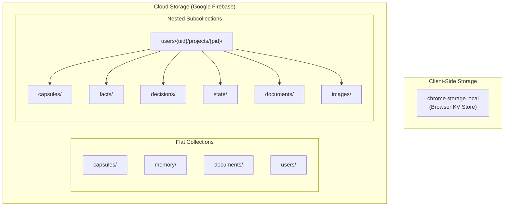

# Storage — Synapse AI Link

> All storage structures documented here are derived from actual code in the repository.
> Field names, types, and relationships reflect what is read and written in the codebase.

---

## Storage Architecture Overview



---

## chrome.storage.local

Local storage is the **primary read source** for all capsule operations. Firestore is the secondary source and cloud backup.

### Key: `capsules`
**Type:** `Array<CapsuleObject>`
**Writer:** `popup/popup.js` → `syncWithCloud()`, content script feedback
**Reader:** `popup/popup.js` → `loadCapsules()`, `content.js` → capsule injection

```javascript
capsules = [
  {
    id: "string",            // Unique capsule identifier (e.g., "cap-flutter-app-1234")
    key: "@CAP-FLUTTER",     // @CAP- prefixed recall key
    project: "Flutter App",  // Project name
    owner_uid: "string",     // Firebase UID
    // ... full capsule JSON (see Capsule Structure below)
  }
]
```

### Key: `synapse_vault`
**Type:** `Array<VaultDocument>`
**Writer:** `popup/popup.js` → `processVaultFiles()`
**Reader:** `popup/popup.js` → `renderVault()`, `background.js` → `saveCapsule` (doc sync)

```javascript
synapse_vault = [
  {
    id: "string",              // Document ID (slugified filename)
    title: "datasheet.pdf",    // Original filename
    type: "pdf",               // File type: pdf | docx | pptx | txt
    compressedText: "string",  // head(60%) + [compressed] + tail(40%)
    charCount: 4200,           // Character count of extracted text
    status: "ready",           // "ready" | "processing"
    addedAt: "ISO timestamp",  // When added to vault
    source: "pdf_upload",      // Source type
    summary: "string",         // Groq-generated summary (after processing)
    concepts: ["string"],      // Groq-extracted concepts
    facts: ["string"]          // Groq-extracted facts
  }
]
```

### Key: `synapse_intercepted`
**Type:** `Object<url, Array<DocumentObject>>`
**Writer:** `content.js`
**Reader:** `background.js` → `saveCapsule` (document sync)

```javascript
synapse_intercepted = {
  "https://chatgpt.com/c/abc123": [
    {
      title: "filename.pdf",
      type: "application/pdf",
      compressedText: "string",
      charCount: 1200,
      capturedAt: "ISO timestamp",
      source: "intercepted",
      isImage: false
    }
  ]
}
```

### Key: `synapse_auth_status`
**Type:** `Boolean`
**Writer:** `auth.js` → `onAuthStateChange()`, `welcome.js` → `syncAuthWithExtension()`, `background.js` → `externalAuth` handler
**Reader:** `content.js`, `auth-ui.js`, `popup.js`

```javascript
synapse_auth_status = true  // or false
```

### Key: `synapse_auth_user`
**Type:** `Object | null`
**Writer:** `welcome.js` → `syncAuthWithExtension()`, `background.js`
**Reader:** `popup/popup.js` → `loadCapsules()` (filters by owner_uid)

```javascript
synapse_auth_user = {
  uid: "firebase-user-uid",
  email: "user@example.com",
  name: "Display Name"
}
```

---

## Firestore Collections

### Collection: `capsules`

**Path:** `capsules/{capsuleId}`
**Writer:** `background.js` → `saveCapsule` handler
**Reader:** `background.js` → `syncCapsules` (query by `owner_uid`), `resolveCapsule` (query by `key`)

**Document Structure:**
```javascript
{
  // Identity
  id: "string",                      // Capsule ID
  key: "@CAP-PROJECTNAME",           // Recall key
  owner_uid: "string",               // Firebase UID ("anonymous" if not logged in)
  createdAt: serverTimestamp(),      // Firestore server timestamp

  // Layer 1: Identity
  project: "Project Name",
  project_purpose: "string",
  final_objective: "string",
  project_type: "hardware|software|study",

  // Layer 2: Architecture
  major_components: ["string"],
  system_design: ["string"],
  technology_stack: ["string"],

  // Layer 3: State
  current_step: "string",
  next_step: "string",
  completed: ["string"],
  in_progress: ["string"],
  blocked_by: ["string"],

  // Layer 4: Facts
  stored_facts: [
    { fact: "string", type: "string", priority: 1 }  // priority: 1=high, 2=medium, 3=low
  ],
  user_decisions: ["string"],
  important_concepts: ["string"],

  // Document Context
  document_context: {
    documents: [
      {
        title: "filename.pdf",
        type: "pdf",
        key_content: "string",
        isImage: false
      }
    ]
  },

  // Extras
  topics: ["string"],
  user_preferences: ["string"],
  current_goal: "string",
  unresolved_issues: ["string"]
}
```

**Indexes required (inferred from queries):**
- `owner_uid` — for `syncCapsules` query
- `key` — for `resolveCapsule` query

---

### Collection: `memory`

**Path:** `memory/{uid}`
**Writer:** `background.js` → `saveCapsule` (merge write on every save)
**Reader:** `background.js` → `loadProjectMemory` (if no project name specified)

```javascript
{
  lastProject: "Project Name",      // Most recently updated project
  allTopics: ["string"],            // arrayUnion accumulation of all topics
  allConcepts: ["string"],          // arrayUnion accumulation of all concepts
  userPreferences: ["string"],      // Latest user preferences
  lastGoal: "string",               // Most recent goal
  unresolvedIssues: ["string"],     // Most recent unresolved issues
  lastUpdated: serverTimestamp(),
  sessionCount: 42                  // increment(1) on every capsule save
}
```

---

### Collection: `documents`

**Path:** `documents/{docId}`
**Writer:** `background.js` → `processPDF` handler
**Reader:** Not directly read in popup code; accessed via project subcollection

```javascript
{
  filename: "datasheet.pdf",
  title: "datasheet.pdf",          // legacy compatibility alias
  summary: "string",               // Groq-generated summary
  concepts: ["string"],            // Groq-extracted concepts
  facts: ["string"],               // Groq-extracted facts
  pageCount: 12,
  projectId: "project-id-slug",
  charCount: 8432,                 // legacy compatibility
  source: "pdf_upload",            // legacy compatibility
  compressedText: "string",        // text.slice(0, 4000) — legacy compatibility
  uploadedAt: serverTimestamp()
}
```

---

### Collection: `users`

**Path:** `users/{uid}`
**Writer:** `auth.js` → `loginUser()`, `registerUser()`, `loginWithGoogle()`; `welcome.js`; `profile.js` → `updateUserProfile()`
**Reader:** `profile.js` → `getUserProfile()`; `auth-ui.js` → profile screen population

```javascript
{
  name: "Display Name",
  email: "user@example.com",
  provider: "email" | "google",
  createdAt: "ISO timestamp",
  lastLogin: "ISO timestamp",
  uid: "string"                    // included in welcome.js write
}
```

---

### Subcollection: `users/{uid}/projects/{projectId}`

**Project document** (`users/{uid}/projects/{projectId}`):

```javascript
{
  projectName: "Project Name",
  purpose: "string",
  finalObjective: "string",
  projectType: "hardware|software|study",
  major_components: ["string"],
  system_design: ["string"],
  technology_stack: ["string"],
  createdAt: "ISO timestamp",      // preserved on subsequent updates
  updatedAt: serverTimestamp()
}
```

**`projectId` format:** `projectName.toLowerCase().replace(/[^a-z0-9]+/g, '-').replace(/(^-|-$)/g, '')`

---

### Subcollection: `users/{uid}/projects/{pid}/capsules/{capsuleId}`

Same structure as `capsules/{capsuleId}` — full capsule document duplicated here for project-scoped access.

---

### Subcollection: `users/{uid}/projects/{pid}/facts/{factId}`

**`factId` format:** `factValue.toLowerCase().replace(/[^a-z0-9]+/g, '-').substring(0, 100)`

```javascript
{
  type: "hardware|config|general|other",
  value: "Fact text string",
  importance: "high|medium|low",
  createdAt: serverTimestamp()
}
```

**Importance mapping from capsule priority:**
- `priority === 1` → `importance = "high"`
- `priority === 2` → `importance = "medium"`
- `priority === 3` → `importance = "low"`

---

### Subcollection: `users/{uid}/projects/{pid}/decisions/{decisionId}`

**`decisionId` format:** Same slugification as factId

```javascript
{
  value: "Decision text string",
  createdAt: serverTimestamp()
}
```

---

### Subcollection: `users/{uid}/projects/{pid}/state/current`

Single document at fixed ID `"current"`:

```javascript
{
  currentStep: "string",
  nextStep: "string",
  completed: ["string"],
  inProgress: ["string"],
  blockedBy: ["string"],
  updatedAt: serverTimestamp()
}
```

---

### Subcollection: `users/{uid}/projects/{pid}/documents/{docId}`

```javascript
{
  title: "filename.pdf",
  type: "pdf|docx|unknown",
  compressedText: "string",
  charCount: 1200,
  addedAt: "ISO timestamp",
  source: "intercepted|pdf_upload|unknown"
}
```

---

### Subcollection: `users/{uid}/projects/{pid}/images/{imageId}`

```javascript
{
  title: "screenshot.png",
  type: "image/png",
  description: "string",           // from intercepted doc text/alt
  capturedAt: "ISO timestamp"
}
```

**Image detection criteria (from code):**
```javascript
const isImage = d.isImage
  || (matched && matched.isImage)
  || (docType && docType.startsWith("image/"))
  || /\.(png|jpe?g|gif|webp|bmp)$/i.test(docTitle);
```

---

### Dev Artifact: `test_collection/test_connection`

Written by `testFirestoreConnection()` in `background.js`. Exists as a connectivity test document. Not part of application data model.

```javascript
{
  test: "Firestore Connected",
  timestamp: "ISO timestamp"
}
```

---

## Capsule Text Compression Algorithm

```javascript
function compressTextLocally(raw, maxChars) {
  if (!raw || !raw.trim()) return "";
  const cleaned = raw.replace(/\s+/g, " ").trim();
  if (cleaned.length <= maxChars) return cleaned;
  const head = cleaned.slice(0, Math.floor(maxChars * 0.6));
  const tail = cleaned.slice(-Math.floor(maxChars * 0.4));
  return head + "\n\n[...compressed...]\n\n" + tail;
}
```

**Rationale from code:** Preserves document introduction (60%) for context and conclusion (40%) for results, which typically contain the most relevant information for AI context.

---

## Storage Access Pattern Summary

| Operation | Primary Store | Fallback Store | Latency Class |
|---|---|---|---|
| Load capsules in popup | `chrome.storage.local` | Firestore (sync on open) | Fast |
| Resolve `@CAP-*` on Enter | `chrome.storage.local` | Firestore query | Fast |
| Save new capsule | Firestore (primary) | Local cache updated | Medium |
| Check auth state | `chrome.storage.local` | Firebase Auth state | Fast |
| Load vault documents | `chrome.storage.local` | Firestore `vault` | Fast |
| Load project memory | Firestore | None | Medium |
| Scan facts (30s interval) | `chrome.storage.local` only | None | Fast |
