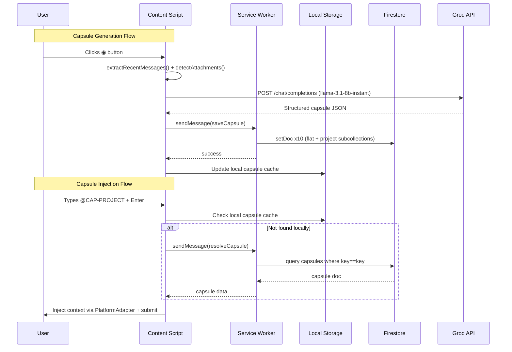

# System Design — Synapse AI Link

> Professional system design document reconstructed from codebase analysis.

---

## Goals

### Primary Goal
Enable users to save structured memory from any AI conversation as a portable "capsule" and instantly inject that context into any other AI platform — eliminating the context-loss problem inherent to stateless LLM sessions.

### Design Goals (As Implemented)

| Goal | Implementation Evidence |
|---|---|
| Zero-backend architecture | No server code present; Firebase + Groq handle all server-side needs |
| Local-first performance | `chrome.storage.local` is primary read source; Firestore is secondary |
| Cross-platform compatibility | 4 platform-specific DOM adapters in `content.js` |
| Graceful degradation | Local capsule fallback if Groq fails; offline banner if Firestore unavailable |
| Privacy by default | Files processed in-browser via PDF.js and Mammoth.js; no upload to custom server |

---

## System Constraints

| Constraint | Source |
|---|---|
| Must run as Chrome Extension (MV3) | `manifest.json` manifest_version: 3 |
| No persistent background process | Service worker terminates when idle |
| PDF input capped at 8000 chars for AI | `background.js` → `pdfText.slice(0, 8000)` |
| Text compression at configurable maxChars | `popup.js` → `compressTextLocally()` |
| Capsule key must match `@CAP-[A-Z0-9-]+` | `content.js` key format |
| Firebase SDK must be local (no CDN) | `libs/firebase/` — required for extension CSP compliance |
| No custom server endpoints | All API calls go directly to Groq and Firebase |

---

## Modules

### Module 1: Authentication Module

**Files:** `popup/auth.js`, `popup/auth-ui.js`, `popup/security.js`, `welcome.js`

**Responsibilities:**
- Wrap Firebase Auth for email/password and Google OAuth flows
- Manage 8-screen SPA routing based on auth state
- Sync auth status to `chrome.storage.local` for cross-context access
- Handle password change with reauthentication
- Accept external auth from `synapse-ai.app`

**State transitions:**
```
Unauthenticated → [signIn / signUp / Google] → Authenticated → Dashboard
Authenticated → [logout] → Unauthenticated → welcome.html
```

---

### Module 2: Content Script Engine

**File:** `content.js`

**Responsibilities:**
- Inject Synapse button into LLM input toolbars
- Scrape conversation DOM using platform-specific selectors
- Generate capsules via Groq API or local fallback
- Inject capsule context via platform-specific adapter
- Run background fact extraction every 30 seconds

**Platform adapters implemented:**

| Platform | Input Target | Injection Method |
|---|---|---|
| ChatGPT | `textarea` or `[contenteditable]` | React synthetic value setter |
| Claude | ProseMirror `[contenteditable]` | `execCommand('insertText')` |
| Gemini | Quill/Lexical `[contenteditable]` | `ClipboardEvent` paste |
| Perplexity | Native `textarea` | Direct value + `input` event |

---

### Module 3: Capsule Memory Engine

**Files:** `background.js`, `content.js`

**The capsule is a structured JSON object with 6 layers:**

```
Capsule
├── layer1_identity   — project name, purpose, final objective, type
├── layer2_architecture — components, system design, tech stack
├── layer3_state      — current step, next step, completed[], in_progress[], blocked_by[]
├── layer4_facts      — stored_facts[], user_decisions[], important_concepts[]
├── document_summary  — attached documents with key content
└── user_preferences  — inferred user preferences
```

**Generation pipeline:**
1. `extractRecentMessages()` — scrapes conversation DOM
2. `detectAttachmentsInElement()` — finds referenced files
3. Groq API call → structured JSON
4. `generateCapsuleLocally()` — fallback if Groq fails
5. `sendMessage({action: "saveCapsule"})` → background.js
6. Background writes to up to 10 Firestore documents

---

### Module 4: Document Vault

**Files:** `popup/popup.js`, `background.js`

**Responsibilities:**
- Accept PDF, DOCX, PPTX, TXT file drops
- Extract text in-browser (PDF.js / Mammoth.js)
- Compress extracted text using head+tail strategy
- Submit to Groq for semantic summarization
- Store in Firestore `documents/` and project subcollections
- Provide document selector UI when generating capsules

---

### Module 5: Popup Dashboard

**Files:** `popup/popup.html`, `popup/popup.js`

**8 Screens:**

| Screen ID | Purpose |
|---|---|
| `authScreen` | Auth gate with "Sign In on Website" redirect |
| `dashboardScreen` | Stats grid + recent projects + action drawer |
| `mainAppScreen` | Saved capsules list + Document Vault |
| `profileScreen` | Name edit + account details |
| `securityScreen` | Password change + reset email |
| `guidelinesScreen` | Community guidelines |
| `contactScreen` | Creator contact info |
| `aboutScreen` | Version + creator info |

---

### Module 6: Firebase Integration

**File:** `popup/firebase.js`

**Exports all required Firebase functions** from local SDK copies. Initializes:
- `app` — Firebase app instance
- `auth` — Firebase Auth instance
- `provider` — GoogleAuthProvider instance
- `db` — Firestore instance

**Firebase Project:** `synapse-ai-99dd0` (projectId from `firebase.js`)

---

## Module Interactions



---

## Design Decisions Found in Code

### Dual-Write Strategy (Flat + Nested)
Capsules are written to both `capsules/{id}` (flat, for fast key resolution) and `users/{uid}/projects/{pid}/capsules/{id}` (nested, for project-scoped queries). This trades write cost for read flexibility.
> Source: `background.js` → `saveCapsule` handler

### Local-First Reads
Capsule resolution checks `chrome.storage.local` before Firestore. This minimizes latency on the critical path (user pressing Enter to inject).
> Source: `content.js` → `resolveCapsuleKey()`

### Local SDK Copies
Firebase SDK is bundled in `libs/firebase/` rather than loaded from CDN. This is required because Chrome Extensions have a strict Content Security Policy that blocks remote script loading.
> Source: `manifest.json`, `popup/firebase.js` imports

### Service Worker Auth Timeout
`getCurrentUserAsync()` uses a 1-second `setTimeout` fallback because service workers can cold-start before Firebase Auth restores from IndexedDB persistence.
> Source: `background.js` → `getCurrentUserAsync()`

### Text Head+Tail Compression
Long documents are compressed by keeping 60% from the beginning and 40% from the end. This preserves document introductions (context) and conclusions (results), which typically contain the most useful information.
> Source: `popup/popup.js` → `compressTextLocally()`
