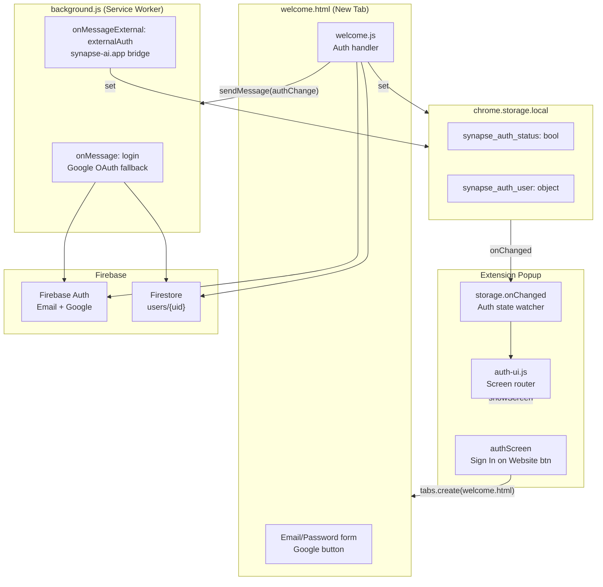
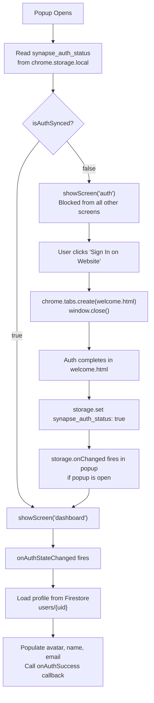
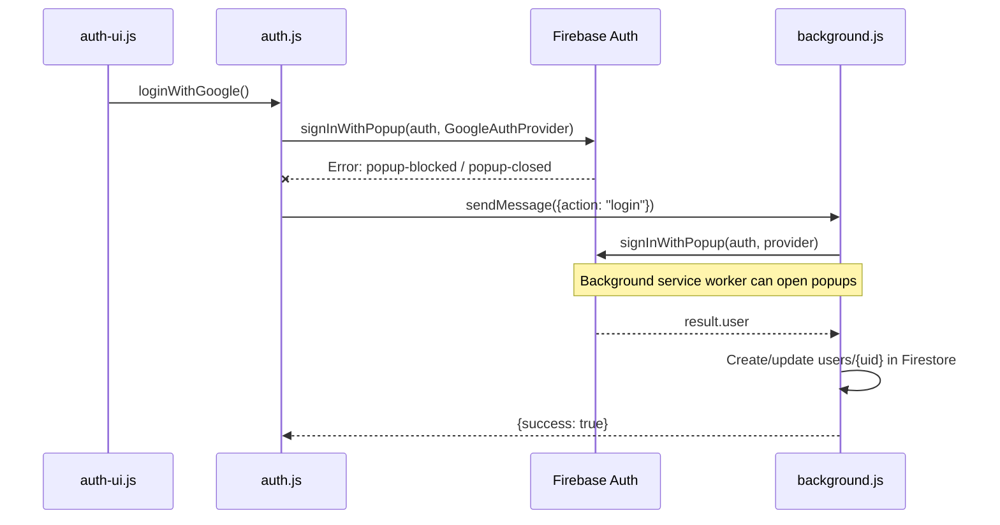

# Design — Authentication

## Overview

Authentication in Synapse AI Link is split across two entry points: `welcome.html` (the primary auth portal) and `background.js` (Google OAuth fallback). The popup itself redirects to `welcome.html` rather than hosting auth inline — this is an intentional architectural decision (ADR-010) due to Chrome Extension popup limitations with OAuth popups.

---

## Auth Architecture



---

## Screen Routing Logic



---

## Firestore User Document

Written on first login and updated on every subsequent login:

```javascript
// Created on registration
{
  uid: "firebase-uid",
  name: "Display Name",
  email: "user@example.com",
  provider: "email" | "google",
  createdAt: "2024-01-15T10:30:00.000Z",  // ISO string, set once
  lastLogin: "2024-06-08T14:22:00.000Z"   // ISO string, updated on every login
}
```

**Note:** `createdAt` must never be overwritten on subsequent logins — code checks `userDoc.exists()` and only calls `updateDoc` for `lastLogin` if document already exists.

---

## Service Worker Cold Start Handling

```javascript
function getCurrentUserAsync() {
    return new Promise((resolve) => {
        // Case 1: Already available (warm service worker)
        if (auth.currentUser) {
            resolve(auth.currentUser);
            return;
        }
        // Case 2: Wait for Firebase to restore from IndexedDB
        const unsubscribe = auth.onAuthStateChanged((user) => {
            unsubscribe();
            resolve(user);
        });
        // Case 3: Hard timeout — resolve with whatever is available after 1s
        setTimeout(() => {
            resolve(auth.currentUser);
        }, 1000);
    });
}
```

**Why this matters:** Chrome MV3 service workers terminate after ~30 seconds of inactivity. When they restart (cold start), Firebase Auth needs time to restore the session from IndexedDB before `auth.currentUser` is populated. The timeout ensures operations don't hang indefinitely.

---

## Google OAuth — Popup Blocked Fallback



---

## Security Considerations

| Concern | Implementation |
|---|---|
| Password change requires current password | `reauthenticateWithCredential` before `updatePassword` |
| Google users blocked from email password change | `user.providerData.some(p => p.providerId === 'google.com')` check in `security.js` |
| Auth status in storage is a UI hint only | Firebase SDK enforces actual token validity on all API calls |
| External auth from `synapse-ai.app` | Limited by `externally_connectable` in manifest; only that domain can send external messages |
| Unauthenticated users blocked from all screens | `showScreen()` forces `auth` screen if `!isAuthSynced` |
