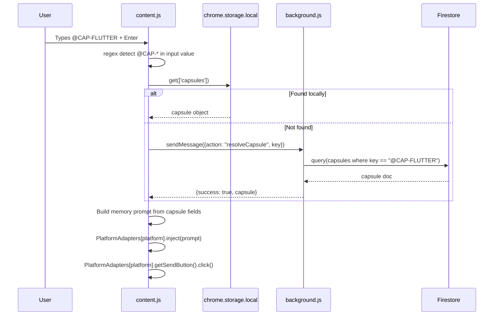

# Design — Capsule Memory Engine

## Overview

The Capsule Memory Engine spans two execution contexts: `content.js` (runs inside the LLM page) and `background.js` (service worker). The content script handles DOM scraping, Groq API calls, and UI. The service worker handles all Firestore writes.

---

## Architecture

```mermaid
graph TB
    subgraph LLMPage["LLM Page (content.js)"]
        BTN["◉ Synapse Button\n#synapse-input-btn"]
        POP["Popover UI\n#synapse-popover"]
        SCRAPE["extractRecentMessages()\nPlatform-specific DOM scrapers"]
        ATTACH["detectAttachmentsInElement()\nFile reference detection"]
        TITLE["generateSmartTitle()\nPage title → first message"]
        GEN["generateCapsule()\nGroq API call"]
        FALLBACK["generateCapsuleLocally()\nHeuristic fallback"]
        INJECT["PlatformAdapters\nchatgpt / claude / gemini / perplexity"]
        SCANNER["Fact Scanner\nsetInterval(30s)"]
    end

    subgraph ServiceWorker["Service Worker (background.js)"]
        SAVE["saveCapsule handler\n10x Firestore writes"]
        RESOLVE["resolveCapsule handler\nQuery by key"]
        MEMORY["memory/{uid} update\narrayUnion + increment"]
    end

    subgraph Storage["Storage"]
        LS["chrome.storage.local\ncapsules[]"]
        FS_FLAT["Firestore\ncapsules/{id}"]
        FS_PROJ["Firestore\nusers/{uid}/projects/{pid}/..."]
    end

    BTN -->|click| POP
    POP -->|Generate| SCRAPE
    POP -->|Generate| ATTACH
    SCRAPE --> TITLE
    TITLE --> GEN
    GEN -->|Groq API call| GEN
    GEN -->|failure| FALLBACK
    GEN -->|success| SAVE
    FALLBACK --> SAVE
    SAVE --> FS_FLAT
    SAVE --> FS_PROJ
    SAVE --> MEMORY
    INJECT -->|@CAP-KEY + Enter| RESOLVE
    RESOLVE -->|check first| LS
    RESOLVE -->|fallback| FS_FLAT
    SCANNER --> LS
```

---

## Capsule JSON Schema

```json
{
  "id": "string",
  "key": "@CAP-PROJECTNAME",
  "owner_uid": "string",
  "createdAt": "serverTimestamp",

  "project": "string",
  "project_purpose": "string",
  "final_objective": "string",
  "project_type": "hardware | software | study",

  "major_components": ["string"],
  "system_design": ["string"],
  "technology_stack": ["string"],

  "current_step": "string",
  "next_step": "string",
  "completed": ["string"],
  "in_progress": ["string"],
  "blocked_by": ["string"],

  "stored_facts": [
    { "fact": "string", "type": "string", "priority": 1 }
  ],
  "user_decisions": ["string"],
  "important_concepts": ["string"],

  "document_context": {
    "documents": [
      { "title": "string", "type": "string", "key_content": "string" }
    ]
  },

  "topics": ["string"],
  "user_preferences": ["string"],
  "current_goal": "string",
  "unresolved_issues": ["string"]
}
```

---

## Groq API Prompt Design

The capsule generation prompt instructs `llama-3.1-8b-instant` to:

1. Analyze the full conversation turn array
2. Identify the project, its purpose, and final objective
3. Extract the current working state (completed steps, in-progress, blockers)
4. Extract hard technical facts with priority levels (1=critical, 2=important, 3=contextual)
5. Identify referenced documents and their key content
6. Infer user preferences from communication style

**Model config:** `temperature: 0.2`, `max_tokens: 800` — low temperature ensures deterministic structured output.

---

## Platform Adapter Design

Each adapter implements the same interface:

```javascript
{
  getInputBox()    → HTMLElement | null,
  getSendButton()  → HTMLElement | null,
  inject(text)     → void
}
```

### ChatGPT Adapter
- `getInputBox()`: queries `textarea`, `[contenteditable][data-id]`, or `#prompt-textarea`
- `inject(text)`: uses `Object.getOwnPropertyDescriptor(HTMLTextAreaElement.prototype, 'value').set.call(el, text)` then dispatches synthetic `input` + `change` events to trigger React's controlled component state update

### Claude Adapter
- `getInputBox()`: queries `[contenteditable].ProseMirror` or `div[contenteditable]`
- `inject(text)`: focuses element, selects all, then `document.execCommand('insertText', false, text)` — ProseMirror listens to this command

### Gemini Adapter
- `getInputBox()`: queries `rich-textarea` or `div.ql-editor` or `[contenteditable]`
- `inject(text)`: constructs a `ClipboardEvent('paste')` with `clipboardData` containing `text/plain` data and dispatches it — Quill/Lexical editors handle paste events natively

### Perplexity Adapter
- `getInputBox()`: queries `textarea[placeholder]` or `textarea`
- `inject(text)`: direct `element.value = text` + dispatch `new Event('input', {bubbles: true})`

---

## Capsule Injection Flow



---

## Fact Categories and Regex Patterns

| Category | Pattern Examples |
|---|---|
| `hardware_configuration` | Pin numbers, voltage specs, component names, `GPIO`, `I2C`, `SPI` |
| `code_detail` | Variable names, function signatures, API keys mentioned in context |
| `system_configuration` | Port numbers, endpoints, config values, environment flags |
| `user_decision` | "I decided to use", "We will", "Going with", "Chose" |
| `system_state` | "Currently at", "Blocked by", "Working on", "Stuck on" |
| `study_fact` | Definitions, formulas ("is defined as", "equals", "formula:") |

---

## Text Compression Algorithm

Applied to all vault documents before storage to stay within Firestore limits:

```
compressTextLocally(raw, maxChars):
  1. Normalize whitespace: replace /\s+/g with single space
  2. If length <= maxChars: return as-is
  3. head = first 60% of maxChars characters
  4. tail = last 40% of maxChars characters
  5. return head + "\n\n[...compressed...]\n\n" + tail
```

Rationale: Introductions contain context, conclusions contain results. Middle sections are most likely to be redundant detail.

---

## Error Handling

| Scenario | Behavior |
|---|---|
| Groq API returns non-200 | Falls back to `generateCapsuleLocally()` |
| Groq returns invalid JSON | Caught by JSON.parse; falls back to local |
| `saveCapsule` Firestore write fails | Logs error, responds `{success: false, error}` to content script |
| `resolveCapsule` key not found | Returns `{success: false, error: "Capsule not found in cloud."}` |
| Content script context invalidated | `isChromeContextValid()` check prevents all storage/runtime calls |
| Platform DOM not found | `getInputBox()` returns null; injection silently skipped with console warning |
