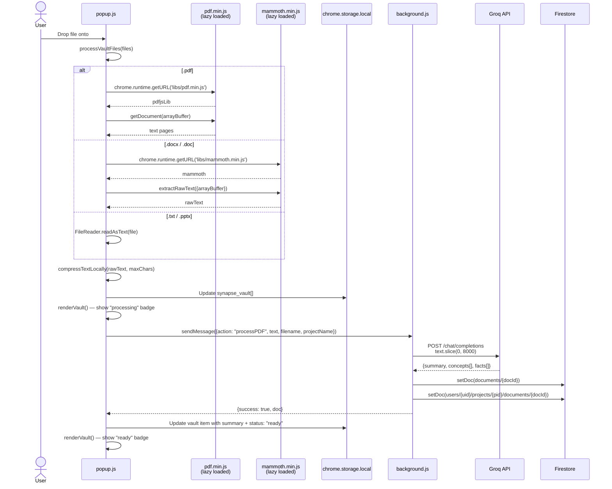

# Design — Document Vault

## Overview

The Document Vault is split between the popup UI (`popup/popup.js`) and the service worker (`background.js`). Text extraction runs entirely in the popup context using lazily-loaded local libraries. AI summarization happens in the service worker to avoid blocking the popup UI.

---

## Architecture



---

## Document Object Schema

```javascript
// In chrome.storage.local (synapse_vault[])
{
  id: "datasheet-pdf",           // slugified filename
  title: "datasheet.pdf",        // original filename
  type: "pdf",                   // file extension
  compressedText: "string",      // head(60%) + [compressed] + tail(40%)
  charCount: 4200,               // character count of extracted text
  status: "ready",               // "ready" | "processing"
  addedAt: "ISO timestamp",
  source: "pdf_upload",
  summary: "string",             // Groq-generated (after processing)
  concepts: ["string"],          // Groq-extracted
  facts: ["string"]              // Groq-extracted
}

// In Firestore documents/{docId}
{
  filename: "datasheet.pdf",
  title: "datasheet.pdf",        // legacy compatibility alias
  summary: "string",
  concepts: ["string"],
  facts: ["string"],
  pageCount: 12,
  projectId: "project-slug",
  charCount: 8432,
  source: "pdf_upload",
  compressedText: "string",      // text.slice(0, 4000) — legacy
  uploadedAt: serverTimestamp()
}
```

---

## Groq Prompt for Document Analysis

```
You are a technical document analyzer for an engineering project memory system.
Analyze the following extracted text from the document "{filename}".

1. Write a concise, 1-2 sentence summary.
2. Extract 5-8 key technical concepts.
   - Hardware docs: component names, pin numbers, specs
   - Study docs: key terms, formulas, theories
   - Software docs: APIs, functions, libraries
3. Extract 3-6 important technical facts or specifications.

Return ONLY a JSON object:
{
  "summary": "one-sentence description",
  "concepts": ["concept 1", "concept 2"],
  "facts": ["fact 1", "fact 2"]
}
```

**Config:** `temperature: 0.2`, `max_tokens: 1000`, `model: llama-3.1-8b-instant`
**Input cap:** `pdfText.slice(0, 8000)` — prevents token limit errors on large documents

---

## Text Compression

```
Input: large document text (potentially 100k+ chars)
       maxChars: configurable (e.g., 4000 for Firestore storage)

Step 1: Normalize — replace /\s+/g with single space, trim
Step 2: If length ≤ maxChars → return as-is (no compression)
Step 3: head = first floor(maxChars × 0.6) chars
        tail = last floor(maxChars × 0.4) chars
Step 4: return head + "\n\n[...compressed...]\n\n" + tail

Example (maxChars = 100):
  head = chars 0–59
  tail = chars (length-40) to end
  joined = "...(60 chars)...\n\n[...compressed...]\n\n...(40 chars)..."
```

---

## Vault UI States

| State | Badge Color | Condition |
|---|---|---|
| Processing | Orange (`#ff9800`) | `status !== "ready"` AND `charCount ≤ 100` |
| Ready | Green (`#4caf50`) | `status === "ready"` OR `charCount > 100` |

File type icons:
- `.pdf` → 📄
- `.pptx` / `.ppt` → 📊
- `.docx` / `.doc` → 📝
- anything else → 📎

---

## Error Handling

| Scenario | Behavior |
|---|---|
| Groq API fails for PDF | Returns fallback: `{summary: "Technical document: {filename}", concepts: ["Document Analysis"], facts: ["Document contains technical content."]}` |
| PDF.js fails to parse | Error logged; vault item marked with `status: "error"` |
| Mammoth.js fails | Error logged; vault item marked with `status: "error"` |
| File too large | `compressTextLocally` handles any size; Groq call capped at 8000 chars |
| Firestore write fails | Error logged in background.js; vault item still saved to local storage |
