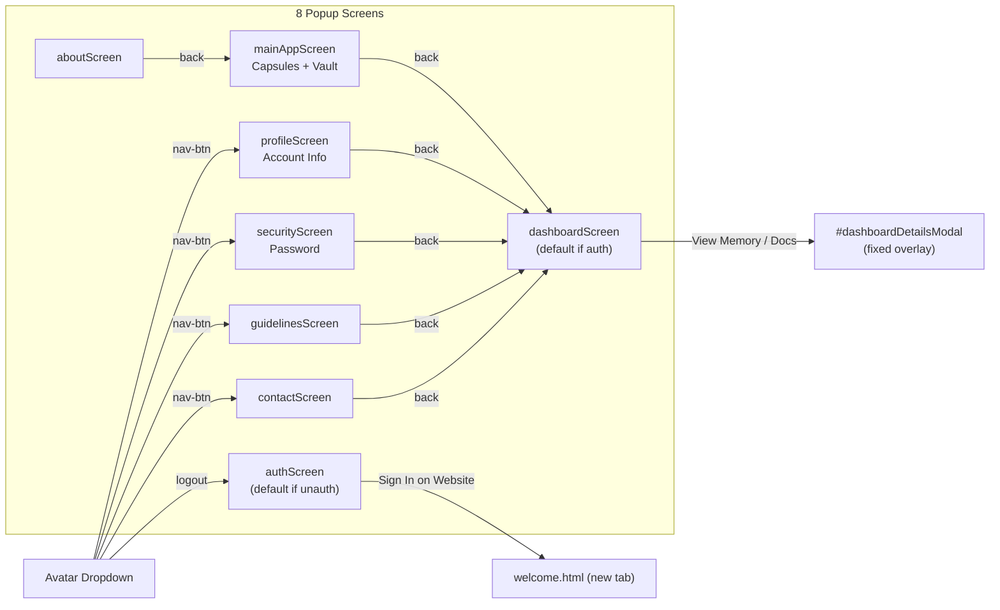
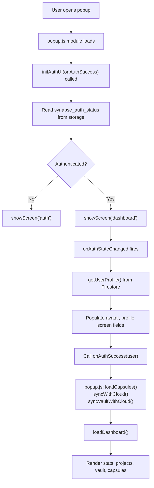

# Design — Popup Dashboard

## Overview

The popup is a 320px-wide single-page application implemented in plain HTML/CSS/JS with no framework. Eight screens share the same HTML document and switch visibility via `.active` CSS class toggling. All data flows through `chrome.storage.local` (fast reads) and Firestore (cloud sync).

---

## Screen Architecture



---

## CSS Design System

All visual styling uses CSS custom properties defined on `:root`:

```css
:root {
  --primary: #00ffcc;           /* Teal — primary accent, gradients, focus */
  --secondary: #0099ff;         /* Blue — secondary accent */
  --bg: #0d0d15;                /* Deep dark background */
  --card-bg: rgba(255,255,255,0.05);  /* Card surfaces */
  --border: rgba(255,255,255,0.08);   /* Subtle borders */
  --text: #f3f4f6;              /* Primary text */
  --text-muted: #9ca3af;        /* Secondary text */
  --error: #f43f5e;             /* Error states */
  --success: #10b981;           /* Success states */
  --font: 'Outfit', sans-serif; /* Typography */
}
```

**Popup dimensions:** `width: 320px`, `min-height: 480px`

---

## Data Flow: Popup Open



---

## Dashboard Stats Computation

```
Projects count   → getDocs(users/{uid}/projects)     → querySnapshot.size
Documents count  → sum of docs in all project /documents subcollections
Facts count      → sum of docs in all project /facts subcollections
Capsules count   → capsules[].filter(c => c.owner_uid == uid).length (local)
```

---

## Header Status Badge

| State | Class | Badge text | Dot |
|---|---|---|---|
| Firestore reachable | `.status-connected` | "Connected" | Pulsing teal |
| Firestore offline | `.status-disconnected` | "Disconnected" | Static red |

---

## Avatar Display Logic

```javascript
// Priority order:
// 1. Google profile photo URL → backgroundImage
// 2. First 2 chars of name (uppercase) → text content

if (profile.photoURL) {
    headerAvatar.style.backgroundImage = `url(${profile.photoURL})`;
    headerAvatar.innerText = '';
} else {
    headerAvatar.style.backgroundImage = 'none';
    headerAvatar.innerText = (profile.name || user.email).substring(0, 2).toUpperCase();
}
```

---

## Popup → Service Worker Communication

All calls from popup.js to background.js go through `chrome.runtime.sendMessage`:

| Message Action | Trigger | Response |
|---|---|---|
| `syncCapsules` | Popup open (after auth) | `{success, capsules[]}` |
| `processPDF` | File uploaded to vault | `{success, doc}` |
| `loadProjectMemory` | Project selected in dashboard | `{success, project, facts, decisions, state, documents}` |

**Note:** Popup also calls Firestore directly (via `popup/firebase.js`) for profile reads, capsule deletes, and vault syncs — these do not go through background.js.

---

## Popup → Content Script Communication

```javascript
// From popup.js → active LLM tab
chrome.tabs.query({active: true, currentWindow: true}, (tabs) => {
    if (tabs[0]?.id) {
        chrome.tabs.sendMessage(tabs[0].id, {action: "generateCapsule", ...params});
    }
});
```

This is the path taken when "Generate Capsule" is clicked from the project action drawer.
