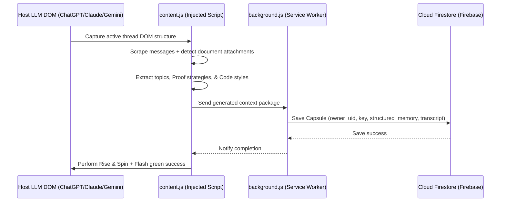
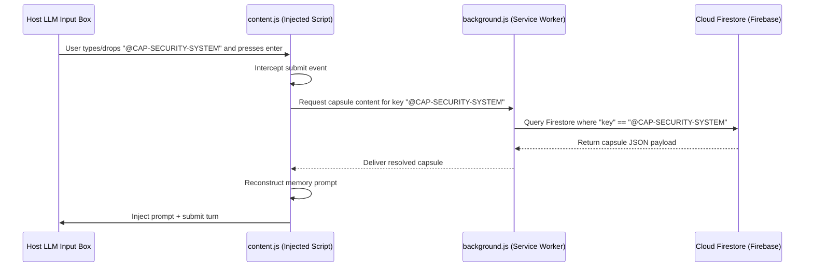

# 🌌 Synapse AI Link

[]()
[]()
[]()
[]()

**Synapse AI Link** is a premium, cross-LLM context bridge and session synchronization Chrome Extension. It seamlessly connects and transfers conversation contexts across **ChatGPT**, **Claude AI**, **Gemini**, and **Perplexity** natively.

Forget copying and pasting massive text histories or losing context when switching AI providers. **Synapse AI Link** allows you to capture your conversation state, sync it to the cloud, and drop it into any other LLM with a single click or drag-and-drop gesture.

---

## 🚀 Key Features

### 1. Organic UI Integration
* **Native-Looking Trigger Icon**: Instead of cluttering the browser with floating action buttons, Synapse injects its trigger button (`◉`) **directly into the LLM input text bar**, placing it organically next to the voice/microphone icons.
* **Glassmorphic popover card**: Clicking the trigger opens a glassmorphic Popover Library showing recent sessions and saved synapses immediately above the text input.

### 2. Glassmorphic Sync Dashboard
* **Firebase Cloud Backup**: Sign in with Email/Password or Google Sign-In to back up your capsule library to a secure Firestore database automatically.
* **Dynamic Cloud Resolution**: Type or drop a capsule key (e.g. `@CAP-FLUTTER`) on any device. The content script intercepts the submission, queries Firestore, resolves the context, and injects it on-the-fly.
* **Cache-First Local Sync**: Syncs with local storage for high-speed offline access and instant loads.

### 3. Invisible Capsule Key Injection
* **Memorable Capsule Keys**: Saves long conversation transcripts behind compact, legible keys (e.g. `@CAP-ALGORITHMS-5`).
* **Advanced State Sync**: Dropping/injecting a key triggers native ProseMirror, draft.js, or React state update events, avoiding DOM glitches on ChatGPT/Claude/Gemini textbox elements.
* **Combined Prompting**: Append custom commands after the key (e.g., `@CAP-FLUTTER Implement the API routing now`) and the extension will compile and submit the full context automatically.

### 4. Cross-LLM Document Vault (PDF/Word/Text)
* **Semantic Document Reconstruction**: Rebuilds the context of academic textbooks, research papers, slide decks, and code files from conversation history without forcing heavy browser file downloads.
* **Metadata Scan**: Extracts active filenames, discussion transcripts, and topic structures.
* **Document Picker**: Choose which files from your personal vault to bundle in each generated capsule.

### 5. Premium Micro-interactions
* **Rise & Spin Animation**: When saving a capsule, the button moves up by `12px`, does a `360-degree spin`, and glows with a neon drop shadow.
* **Success Flash**: Flashes emerald green (`#00c896`) for `600ms` when context register completes.
* **Custom Toast Engine**: Custom-drawn, blur-filtered notifications pop up at the top-right of your screen instead of annoying alert boxes.

---

## 📂 Project Architecture

The codebase has been refactored into a highly modular, readable, and clean separation of concerns:

```
HTK-AI-Capsule/
├── manifest.json              # Extension manifest (Extension configurations)
├── background.js              # Service Worker (handles OAuth logins & Firestore sync)
├── content.js                 # Content Script (DOM scrapers, input injectors, button injection)
├── popup/                     # User Interface & Dashboard Views
│   ├── popup.html             # Dashboard structure & glassmorphic styles
│   ├── popup.js               # Dashboard controller and state management
│   ├── firebase.js            # Initializer & exporter of Firebase SDK client
│   ├── auth.js                # Core Authentication logic (Firebase Auth wrapper)
│   ├── auth-ui.js             # View switcher & form handlers for authentication
│   ├── profile.js             # Personal Information manager
│   └── security.js            # Password security manager
├── libs/                      # Third-party libraries
│   ├── pdf.min.js             # PDF text extractor
│   ├── pdf.worker.min.js      # Background worker for PDF operations
│   ├── mammoth.min.js         # Word Document (.docx) text extractor
│   └── firebase/              # Core Firebase Client SDK libraries
│       ├── firebase-app.js
│       ├── firebase-auth.js
│       └── firebase-firestore.js
├── docs/                      # Documentation and Developer QA
│   ├── docs.md                # Comprehensive user & developer guide
│   └── answers.txt            # Project conceptual design answers
└── archived/                  # Unused legacy files & developer tools
    ├── firebase-app-compat.js
    ├── firebase-auth-compat.js
    └── refactor.py
```

---

## 🛠️ How It Works (Under the Hood)

### The Sync Pipeline


### The Drop Pipeline


---

## ⚙️ Installation & Developer Guide

### Prerequisites
* **Google Chrome** (or any Chromium-based browser like Brave, Arc, Edge).
* Local copy of the `HTK-AI-Capsule` repository.

### Setup Instructions
1. Open Google Chrome and go to `chrome://extensions/`.
2. Turn on **Developer mode** (top-right toggle switch).
3. Click the **Load unpacked** button (top-left).
4. Select the root folder: `HTK-AI-Capsule`.
5. Open any supported LLM (e.g., [ChatGPT](https://chatgpt.com), [Claude AI](https://claude.ai), [Gemini](https://gemini.google.com)).
6. Click the extension icon in your Chrome toolbar to log in, customize your dashboard profile, or drag files into your vault.

---

## 🔒 Security & Privacy
* **Local-First Storage**: User chat sessions are processed locally on the client machine.
* **Encrypted Firebase Transmits**: All transactions to the Firebase Cloud database are encrypted via HTTPS/TLS.
* **Authentication Safeguards**: Secure user profiles are locked down with Firebase Security rules to guarantee that only the owner of a capsule can query or resolve it.

---

Developed with ❤️ by **Hamza Taif (HTK)**.
